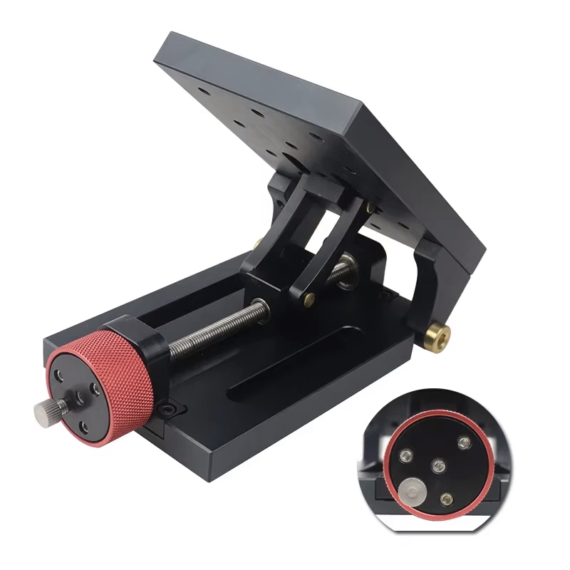
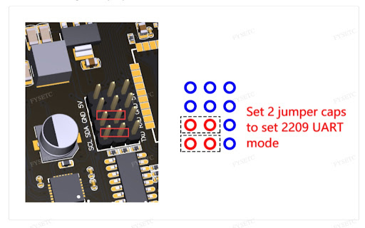

# Polar Align System – Hardware Setup

## ⚠️ Disclaimer

> I'm just an enthusiast sharing this open hardware project, **with no guarantee of success**.
> I’ll do my best to support others trying this build, but my **time is limited**, and my **skills are not professional-grade**.
> This is an **early prototype** and proof of concept — not fully validated yet. I hope to share updated iterations in the future.

## 🧩 3D Model & Files

- The full 3D design is available here:
  👉 [Shapr3D Project Viewer](https://app.shapr3d.com/v/EaET3sDOzzE1rERJT5Xg-)

- All 3D parts (STEP format) are included in the downloadable archive:
  📦 `PolarALIGN_V2_STEP.zip`

---

## 🛒 Mechanical Components (Major)

### 1. Tripod Extension
- Example: [AliExpress – 43€](https://fr.aliexpress.com/item/1005008669077575.html)
- 

### 2. Harmonic Drive (AZM Reduction)
- Model: **MINIF11-100** (Ratio 100:1)
- Example: [AliExpress – 58€](https://fr.aliexpress.com/item/1005007712296652.html)
- 

### 3. Stepper Motor (AZM Drive)
- **1x** Standard NEMA 17 for the Harmonic Drive input.
- Model: **17HS19-2004S1** (or similar high torque)
- Example: [Amazon – ~12€]
- 

### 4. Heavy Duty Tilt Plate (Base Structure)
- *Replaces the old cross-slide table for better stability.*
- Example: [AliExpress – ~80€](https://fr.aliexpress.com/item/1005009718898462.html)
- 

### 5. ALT Worm Gear Motor (Self-Locking)
- Model: **NEMA17 + 5840 Worm Gearbox** (Self-locking/Autobloquant)
- **Gear Ratio:** 1:100
- Prevents the mount from dropping under gravity.
- Example: [AliExpress – ~20€](https://fr.aliexpress.com/item/1005008325671689.html)
- 

### 6. Structural Profiles (Base Chassis)
- Type: **15180 Aluminum Extrusion** (2 Plates needed)
  - **Plate 1 (Main):** Length **250mm**, oriented North-South.
  - **Plate 2 (Cross):** Orthogonal (East-West), aligned flush with the South end of Plate 1.
- ⚠️ **CRITICAL WARNING:** The top and bottom faces of the 15180 profiles are **NOT interchangeable** (they have different slot spacing/patterns). Be absolutely sure of your orientation and assembly direction *before* drilling any holes!
- Cost: ~40€ (for both)
- 

### 7. Orientation Ring (Bearing)
- **Reference**: [igus PRT-02 LC J4](https://www.igus.fr/product/iglidur_PRT_02_LC_J4) (~63€)
- 

---

## ⚡ Electronics & Control

### 8. Main Controller Board
- Board: **FYSETC E4 V1.0** (⚠️ **Pin mapping differs** on V2.0!)
- Features: WiFi + Bluetooth, 4x TMC2209, 240MHz.
- Example: [AliExpress – ~30€](https://fr.aliexpress.com/item/1005001704413148.html)
- 

### 9. Homing & Control
- **Homing Sensor (ALT):** Model **V-156-1C25** (Long lever microswitch) – *< 2€*
- **Home Button:** Metal Push Button (1NO, High head).
  - Specs: Waterproof, LED (3-24V), Latching/Reset, 12mm or 16mm.
  - Material: Nickel-plated Brass – *< 2€*

### 10. Active Feedback Sensor (Gyroscope)
- Model: **MPU-6500** (I2C interface)
- Purpose: Acts as a digital plumb bob. It measures the real physical altitude angle of the tilt table in real-time, allowing the firmware to automatically correct any backlash or friction.
- Cost: ~3€
- 

---

## 🔩 Small Hardware & Fasteners

To complete the assembly, you will need the following "vitamins":

### Coupler (Crucial DIY Modification Required!)
- **Type:** Rigid Clamping Coupler (D25L35)
- **Base Size to Buy:** **5mm to 8mm**
- ⚠️ **THE 5.6mm TRAP:** The external input shaft on the Tilt Plate (where the original manual knob was attached) is **NOT a standard 5mm or 6mm**. It is a weird **5.6mm** diameter shaft driving the internal T8 screw. A standard 6mm coupler will slip, and a 5mm won't fit.
- **The Fix:** You must buy a `5mm to 8mm` coupler and manually enlarge the 5mm hole. Use a tapping tool (thread maker) or a very precise 5.5mm/5.6mm drill bit to bore out the 5mm side until it perfectly grips the 5.6mm shaft.
- *Note: Do not use flexible spider couplers or set-screw couplers. Rigidity is mandatory here.*
- Example: "OKE DE-Coupler Rigid Shaft" – *~3.50€*

### Screws & Nuts
- **Sliding T-Nuts:** M6 for 15180 profile (Pack of 200) – *~7€*
- **Assorted Screws:** M3, M4, M5, M6 (Various lengths: 10mm to 40mm) – *~20€ total*

---

### 💰 Estimated Total: ~**380€ - 400€**

*(Excluding 3D printing filament)*

---

## 🖨️ 3D Printing & Fabrication

- **Material:** All 3D parts printed in **PLA (100% infill)** for maximum stiffness.
- **CNC Machining (Recommended):**
  - For heavy payloads (>10kg), it is highly recommended to CNC machine the **two main load-bearing parts** (highlighted in green in the image below):
    1. The part connecting the Tilt Plate to the IGUS Orientation Ring.
    2. The junction plate connecting the IGUS Orientation Ring to the 250mm 15180 profile.
  - Estimated CNC cost: ~**90€**
- 

### 🧮 Total Budget (with CNC)
- ~390€ Hardware
- + ~90€ CNC Parts
- 🟰 **~480€ Final Project Cost**

---

## 🔌 Wiring & Configuration (CRITICAL)

### ⚠️ UART Jumper Setup

To enable communication between the ESP32 and the drivers, you **MUST** place the jumpers to activate "UART Mode", exactly as shown in the **FYSETC E4 Wiki**.

**1. Locate the Jumper Header:**
Find the block of pins labeled with **TXD / RXD** (near the SCL/SDA pins).
- 

**2. Place the Jumpers:**
Place **2 jumper caps** horizontally on the bottom rows to bridge the communication lines.
* **Without these jumpers**, the ESP32 cannot talk to the motors.
* **Result:** This connects the drivers to the shared UART bus.

> **Note on Addressing:**
> Once these jumpers are in place, the firmware automatically targets the correct drivers using the board's internal routing:
> * **Azimuth (Driver X):** Address 1
> * **Altitude (Driver Y):** Address 2

- **Reference Guide:**
  See the "UART Mode" section in the official wiki: [https://wiki.fysetc.com/docs/E4](https://wiki.fysetc.com/docs/E4)

### 📡 MPU-6500 I2C Wiring
Connect the MPU-6500 module to the FYSETC E4 I2C pins using the following standardized wire colors:
* 🔴 **Red:** VCC (3.3V)
* 🟡 **Yellow:** GND
* 🔵 **Blue:** SCL (E4 Pin 18)
* 🟢 **Green:** SDA (E4 Pin 19)

> 💡 **Anti-EMI Tip:** Keep the I2C wires (Blue/Green) as far away as possible from the stepper motor cables to prevent electromagnetic interference. If possible, twist the GND (Yellow) wire around the I2C lines to act as a shield.

---

## 📸 Assembly Photos

You can find detailed images in the `/IMAGES/ASSEMBLY` folder of this repository.
