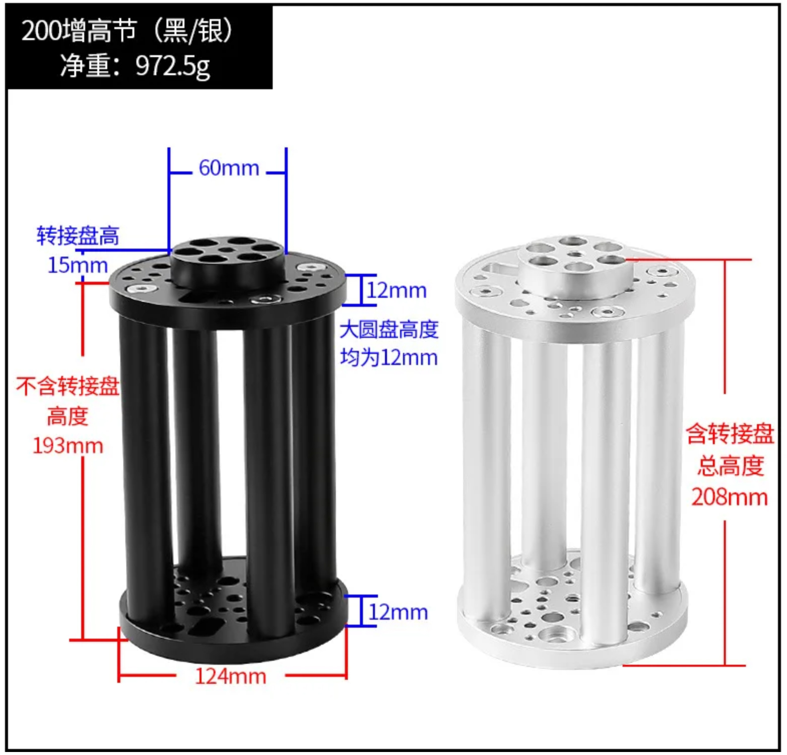
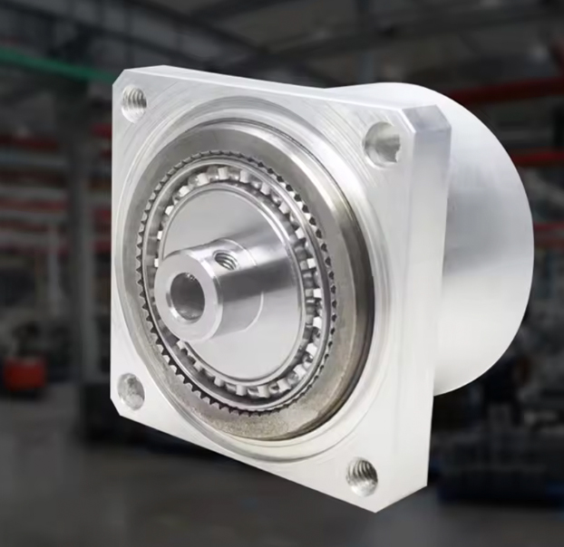
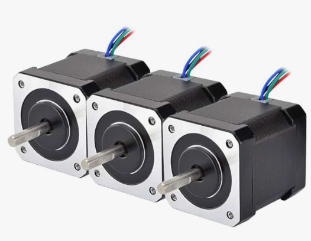
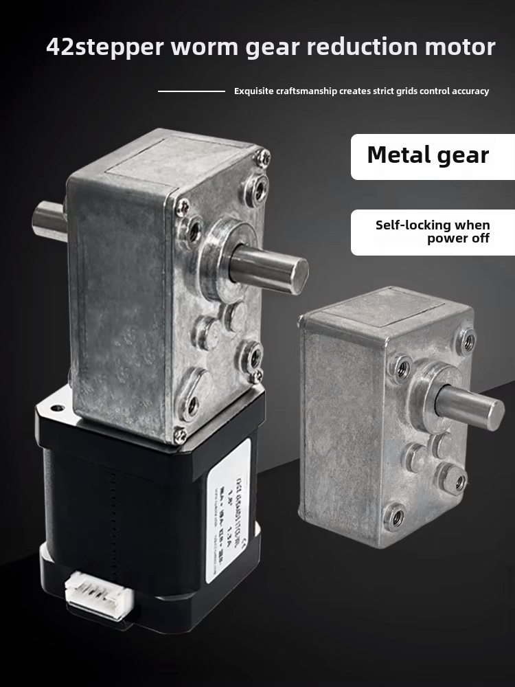
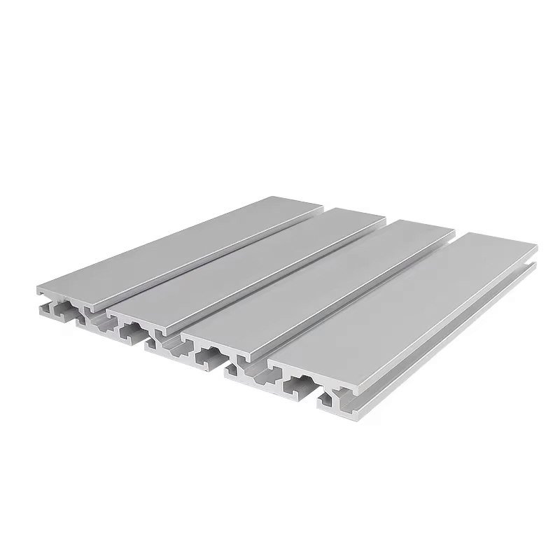
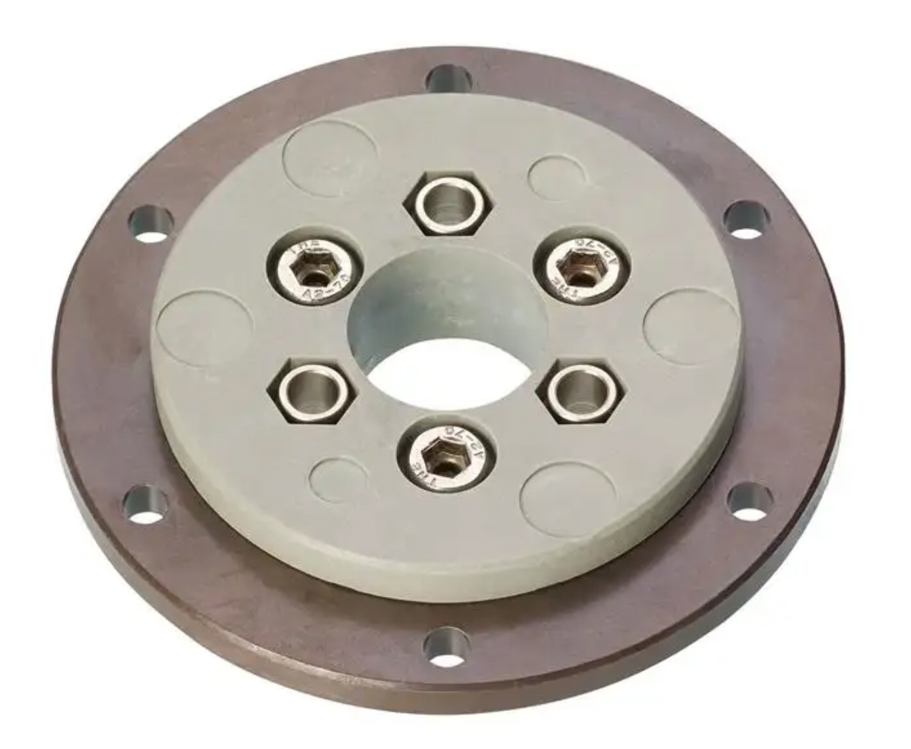
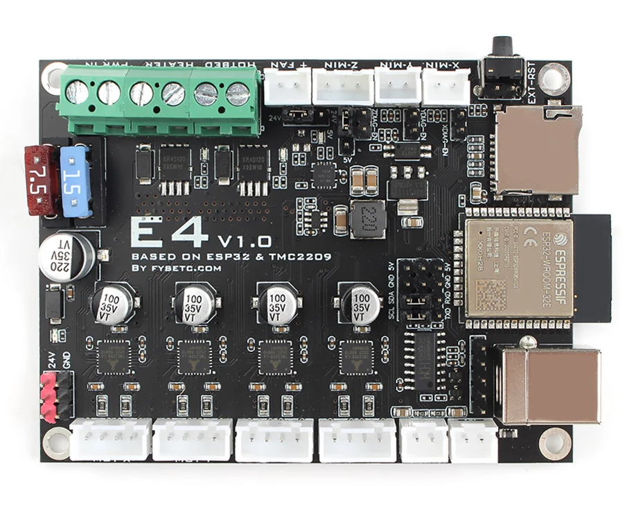
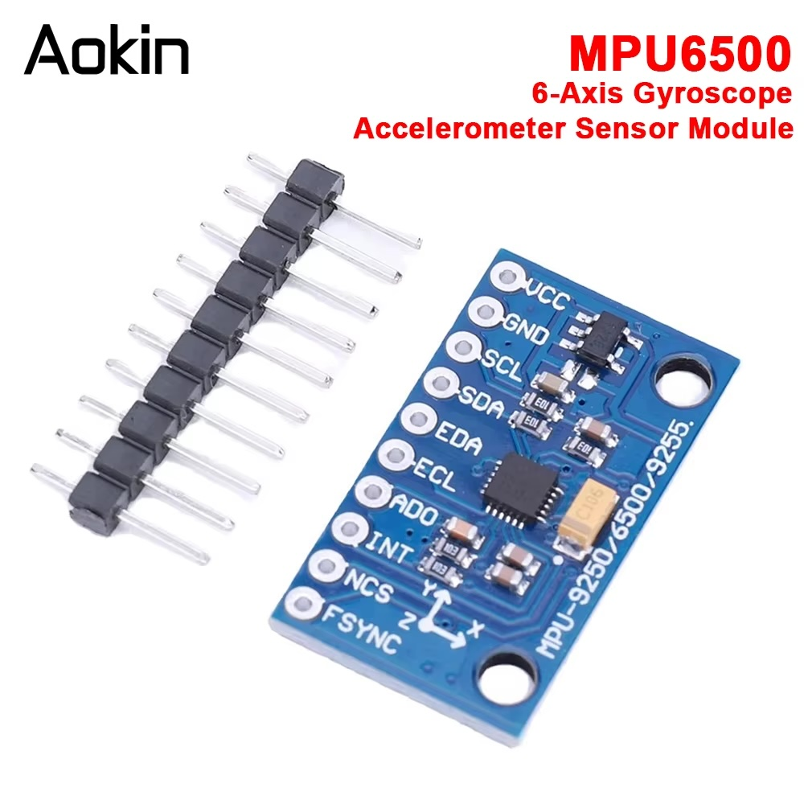
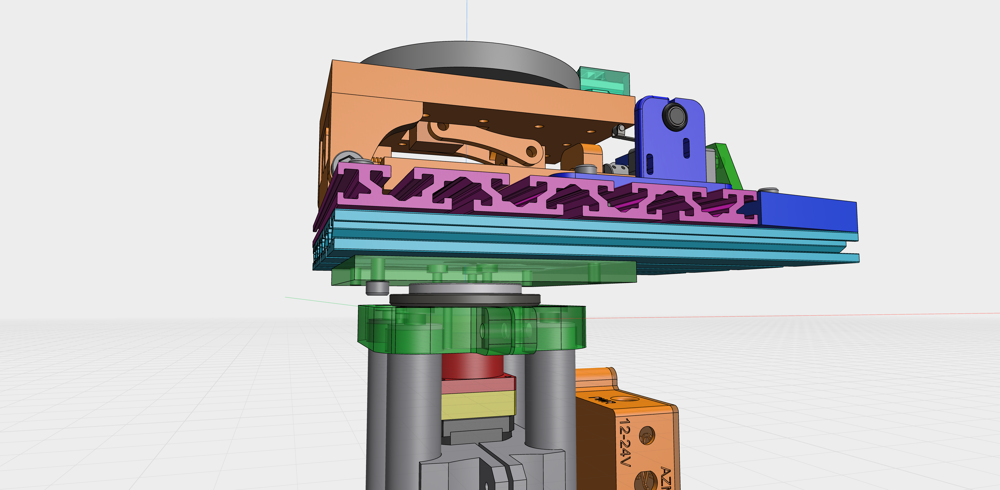

# Polar Align System – Hardware Setup

## ⚠️ Disclaimer

> I'm just an enthusiast sharing this open hardware project, **with no guarantee of success**.
> I'll do my best to support others trying this build, but my **time is limited**, and my **skills are not professional-grade**.
> This is an **early prototype** and proof of concept — not fully validated yet. I hope to share updated iterations in the future.

## 🧩 3D Model & Files

- The full 3D design is available here:
  👉 [Shapr3D Project Viewer](https://app.shapr3d.com/v/xjBj0DmmQmfPPzAL_mYX5)

- All 3D parts (STEP format) are included in the downloadable archive:
  📦 `PolarALIGN_V3_STEP.zip`

- 🛠️ **Drilling Jig Included:** The 3D model archive now includes a custom **Drilling Jig (Gabarit de perçage)**. You can 3D print this tool to easily and accurately mark the drilling hole locations on the 200mm 15180 profile.

---

## ⚖️ Mechanical Design Philosophy & Payload Rating

This mount is designed to carry **heavy astrophotography setups** (long refractors, SCTs, Newtonians with guide scopes and cameras) by eliminating plastic from the structural load path.

### Load Path (telescope → ground)

```
Telescope + EQ Mount
       ↓
  Tilt Plate (cast metal, pivot + T8 lead screw)
       ↓
  Crossed 15180 aluminum profiles (monolithic chassis)
       ↓
  igus PRT-02 LC J4 orientation ring (azimuth bearing)
       ↓
  Tripod extension / pier
```

**Every component in this chain is metal.** The only 3D-printed part is the motor cradle, which carries the weight of the NEMA 17 motor (~350 g) and transmits no telescope load.

### Payload Ratings

| Rating | Max Payload | Use Case |
|--------|-------------|----------|
| **Recommended** | **20 kg** | Safe for all builders with ~2× margin on every component. |
| **Advanced** | **25 kg** | Author-tested. Requires centered payload, proper fastener torque, and careful assembly. |

### Component-by-Component Capacity

| Component | Specification | Load @25 kg | Margin | Limiting? |
|-----------|--------------|-------------|--------|-----------|
| igus PRT-02 – Axial (dynamic) | 4,000 N | ~245 N | **16×** | No |
| igus PRT-02 – Radial (dynamic) | 500 N | ~50 N worst case | **10×** | No |
| igus PRT-02 – Tilting moment | Not published (LC variant) | ~25–37 Nm estimated | **Unknown** | ⚠️ **Assumed weakest** |
| T8×2mm lead screw (bronze nut) | 500–1000 N axial | ~25–40 N @2° tilt | **15–25×** | No |
| UMOT 30:1 output torque | ~2–4 Nm | ~0.25 Nm required | **8–16×** | No |
| 15180 profiles (crossed, bolted) | >5 kN in bending | <250 N | **20×+** | No |
| 3D-printed parts (cradles, brackets, cases) | Non-structural | Motor/sensor weight only | N/A | **Not in load path** |

> 💡 **Upgrading to 30+ kg?** The first component to upgrade would be the igus bearing. The **PRT-01-20** (aluminum housing, same 80 mm diameter) has a published tilting moment of **120 Nm** and would comfortably support 35+ kg setups. It is a drop-in replacement for the PRT-02 LC.

---

## 🛒 Mechanical Components (Major)

### 1. Tripod Extension
- Example: [AliExpress – 43€](https://fr.aliexpress.com/item/1005008669077575.html)
- 

### 2. Harmonic Drive (AZM Reduction)
- Model: **MINIF11-100** (Ratio 100:1)
- Example: [AliExpress – 58€](https://fr.aliexpress.com/item/1005007712296652.html)
- 

### 3. Stepper Motor (AZM Drive)
- **1x** Standard NEMA 17 for the Harmonic Drive input.
- Model: **17HS19-2004S1** (or similar high torque)
- Example: [Amazon – ~12€]
- 

### 4. Heavy Duty Tilt Plate (Base Structure)
- *Replaces the old cross-slide table for better stability.*
- Example: [AliExpress – ~80€](https://fr.aliexpress.com/item/1005009718898462.html)
- 

### 5. ALT Worm Gear Motor (Self-Locking)

The ALT axis uses a **NEMA 17 stepper + UMOT worm gearbox** driving a T8×2mm lead screw through a crank-arm mechanism. The crank adds approximately 5× additional reduction on top of the UMOT ratio.

#### Choosing the right UMOT ratio

This mount operates in a **narrow 0–4° range** (the EQ mount handles most of the latitude setting). The torque requirements at these low tilt angles are minimal, so you can trade torque margin for speed:

| UMOT Ratio | Speed (per 1°) | Typical 2° Adjustment | Torque Margin @25 kg | Self-Locking | Verdict |
|------------|----------------|----------------------|---------------------|--------------|---------|
| **100:1** | 6.3 s | 12.6 s | 80× | ✅ Worm + screw | Very safe, very slow |
| **50:1** | 3.1 s | 6.2 s | 40× | ✅ Worm + screw | Conservative choice |
| **30:1** ⭐ | 1.9 s | 3.8 s | 23× | ⚠️ Screw only | **Recommended — best balance** |
| **17:1** | 1.1 s | 2.2 s | 13× | ❌ Screw only | Fast, tight margins in cold |

> **Why 30:1?** A TPPA session involves 6–8 altitude corrections. At 100:1, this means 1–2 minutes of waiting for motors alone. At 30:1, the same session saves over a minute — significant when you're setting up in the cold and dark.

> **Self-locking explained:** At 100:1 and 50:1, both the worm gear AND the lead screw prevent the telescope from back-driving under gravity (double self-locking). At 30:1 and below, the worm may lose self-locking, but the **T8×2mm lead screw is always self-locking** (helix angle 4° < friction angle ~8.5°). The load on the screw at operating angles is only 25–40 N — trivial for a bronze nut rated at 500–1000 N.

**Author's configuration:** UMOT 30:1 (previously 100:1), which gives ~149:1 total effective ratio.

- Example: [AliExpress – ~20€](https://fr.aliexpress.com/item/1005008325671689.html)
- 

### 🌡️ Motor Thermal Note

The UMOT worm gearbox encloses the NEMA 17 in a compact housing with poor heat dissipation. Even at rest, the TMC2209 sends a holding current that generates heat:

| RMS Current | Power Dissipated | Surface Temperature | Safe for PLA cradle? |
|-------------|-----------------|---------------------|---------------------|
| 800 mA (old default) | ~1.6 W | 55–65°C | ❌ No (PLA softens at ~55°C) |
| **300 mA (new default)** | ~0.2 W | Barely warm | ✅ Yes |
| 400 mA (cold weather) | ~0.4 W | ~35°C | ✅ Yes |

The firmware ships with **300 mA** for the ALT motor. Even at this reduced current, the torque margin remains ≥23× for 30:1 and ≥30× for 100:1 at operating angles (0–4°).

> **Recommendation:** Use **PETG** or **ABS** for the motor cradle if you plan to experiment with higher currents. PLA is fine at 300 mA.

### 6. Structural Profiles (Base Chassis)
- Type: **15180 Aluminum Extrusion** (2 Plates needed)
  - **Plate 1 (Main):** Length **250mm**, oriented North-South.
  - **Plate 2 (Cross):** Orthogonal (East-West), aligned flush with the South end of Plate 1 (200mm length).
- ⚠️ **CRITICAL WARNING:** The top and bottom faces of the 15180 profiles are **NOT interchangeable** (they have different slot spacing/patterns). Be absolutely sure of your orientation and assembly direction *before* drilling any holes!
- Cost: ~40€ (for both)
- 

### 7. Orientation Ring (Bearing)

- **Reference**: [igus PRT-02 LC J4](https://www.igus.fr/product/iglidur_PRT_02_LC_J4) (~63€)
- Type: Polymer slewing ring, maintenance-free, no lubrication needed.
- Outer ring: iguton G (polymer). Inner discs: iglidur J4.

**Key specs (from igus datasheet):**

| Parameter | Value | Relevance |
|-----------|-------|-----------|
| Dynamic axial load | **4,000 N** (~408 kg) | Telescope weight — no concern |
| Static axial load | **13,000 N** (~1,325 kg) | — |
| Dynamic radial load | **500 N** (~51 kg) | Side loads from wind — comfortable |
| Static radial load | **2,000 N** (~204 kg) | — |
| Max RPM | 250 | AZM rotates at <1 RPM — no concern |
| Max temperature | 90°C | Outdoor use — no concern |
| Axial/radial play | ±0.25 mm | Acceptable for polar alignment precision |

> ⚠️ **Tilting moment** (the ability to resist an off-center load trying to tip the bearing) is **not published** for the PRT-02 LC variant. The PRT-01 series (aluminum housing) is rated at 120 Nm. The PRT-02 LC (polymer housing) is likely significantly lower. This is why we cap the recommended payload at 20 kg — to account for this unknown with a safety margin. **Keep your telescope centered on the bearing as much as possible.**

- 

---

## ⚡ Electronics & Control

### 8. Main Controller Board
- Board: **FYSETC E4 V1.0** (⚠️ **Pin mapping differs** on V2.0!)
- Features: WiFi + Bluetooth, 4x TMC2209, 240MHz.
- Example: [AliExpress – ~30€](https://fr.aliexpress.com/item/1005001704413148.html)
- 

### 9. Homing & Control
- **Homing Sensor (ALT):** Model **V-156-1C25** (Long lever microswitch) – *< 2€*
- **Home Button:** Metal Push Button (1NO, High head).
  - Specs: Waterproof, LED (3-24V), Latching/Reset, 12mm or 16mm.
  - Material: Nickel-plated Brass – *< 2€*

### 10. Active Feedback Sensor (Gyroscope)
- Model: **MPU-6500** (I2C interface)
- Purpose: Acts as a digital plumb bob. It measures the real physical altitude angle of the tilt table in real-time, allowing the firmware to automatically correct any backlash or friction.
- Cost: ~3€
- 

---

## 🔩 Small Hardware & Fasteners

To complete the assembly, you will need the following "vitamins":

### Coupler (Crucial DIY Modification Required!)
- **Type:** Rigid Clamping Coupler (D25L35)
- **Base Size to Buy:** **5mm to 8mm**
- ⚠️ **THE 5.6mm TRAP:** The external input shaft on the Tilt Plate (where the original manual knob was attached) is **NOT a standard 5mm or 6mm**. It is a weird **5.6mm** diameter shaft driving the internal T8 screw. A standard 6mm coupler will slip, and a 5mm won't fit.
- **The Fix:** You must buy a `5mm to 8mm` coupler and manually enlarge the 5mm hole. Use a tapping tool (thread maker) or a very precise 5.5mm/5.6mm drill bit to bore out the 5mm side until it perfectly grips the 5.6mm shaft.
- *Note: Do not use flexible spider couplers or set-screw couplers. Rigidity is mandatory here.*
- Example: "OKE DE-Coupler Rigid Shaft" – *~3.50€*

### Screws & Nuts
- **Sliding T-Nuts:** M6 for 15180 profile (Pack of 200) – *~7€*
- **Assorted Screws:** M3, M4, M5, M6 (Various lengths: 10mm to 40mm) – *~20€ total*

---

### 💰 Estimated Total: ~**380€ - 400€**

*(Excluding 3D printing filament)*

---

## 🖨️ 3D Printing & Fabrication

### Printed Parts

Several components are 3D-printed. **None of them are in the telescope load path** — the payload is transmitted entirely through metal components (tilt plate → lead screw → 15180 profiles → igus bearing → tripod).

| Part | Role | Structural Load | Thermal Concern |
|------|------|----------------|-----------------|
| **ALT motor cradle** | Holds the UMOT + NEMA 17, aligns with lead screw | Motor weight only (~350 g) | ⚠️ **Yes** — in direct contact with UMOT housing |
| **AZM motor cradle** | Prevents the Harmonic Drive motor from spinning on itself | Motor weight only, no torque transfer | No |
| **MPU-6500 bracket** | Holds the gyroscope sensor on the tilt plate | Negligible (~5 g sensor) | No |
| **Homing sensor bracket** | Positions the limit switch for ALT homing | Negligible (microswitch actuation force) | No |
| **FYSETC E4 enclosure** | Protects the controller board | None (electronics housing) | No |
| **Power supply case** | Protects the PSU | None (electronics housing) | No |

- **Author's material:** **PLA+CF** (carbon fiber reinforced PLA) — stiffer than standard PLA with slightly better heat resistance (~60°C).
- **Recommended material:** **PETG** (heat resistant to 75°C) for the **ALT motor cradle** specifically, since it sits in direct contact with the UMOT worm gearbox housing which can reach 55–65°C at high motor currents. All other parts can be printed in standard PLA without concern.
- **With the firmware's thermal fix** (`RMS_CURRENT_ALT = 300 mA`), the UMOT housing stays barely warm and PLA+CF or even standard PLA is fine for the ALT cradle.
- **Infill:** 100% for the motor cradles (dimensional stability). Other parts can use 50–80%.

### CNC Machining (Recommended)

For heavy payloads (>15 kg), it is highly recommended to CNC machine the **two main load-bearing junction plates** (highlighted in green in the image below):
  1. The plate connecting the Tilt Plate to the igus Orientation Ring.
  2. The junction plate connecting the igus Orientation Ring to the 250mm 15180 profile.

These plates are in the direct load path and must resist the tilting moment from the telescope. CNC aluminum is far more rigid and dimensionally stable than any 3D-printed alternative.

- Estimated CNC cost: ~**90€**
- 

### 🧮 Total Budget (with CNC)
- ~390€ Hardware
- + ~90€ CNC Parts
- 🟰 **~480€ Final Project Cost**

---

## 🔌 Wiring & Configuration (CRITICAL)

### ⚠️ UART Jumper Setup

To enable communication between the ESP32 and the drivers, you **MUST** place the jumpers to activate "UART Mode", exactly as shown in the **FYSETC E4 Wiki**.

**1. Locate the Jumper Header:**
Find the block of pins labeled with **TXD / RXD** (near the SCL/SDA pins).
- 

**2. Place the Jumpers:**
Place **2 jumper caps** horizontally on the bottom rows to bridge the communication lines.
* **Without these jumpers**, the ESP32 cannot talk to the motors.
* **Result:** This connects the drivers to the shared UART bus.

> **Note on Addressing:**
> Once these jumpers are in place, the firmware automatically targets the correct drivers using the board's internal routing:
> * **Azimuth (Driver X):** Address 1
> * **Altitude (Driver Y):** Address 2

- **Reference Guide:**
  See the "UART Mode" section in the official wiki: [https://wiki.fysetc.com/docs/E4](https://wiki.fysetc.com/docs/E4)

### 📡 MPU-6500 I2C Wiring
Connect the MPU-6500 module to the FYSETC E4 I2C pins using the following standardized wire colors:
* 🔴 **Red:** VCC (3.3V)
* 🟡 **Yellow:** GND
* 🔵 **Blue:** SCL (E4 Pin 18)
* 🟢 **Green:** SDA (E4 Pin 19)

> 💡 **Anti-EMI Tip:** Keep the I2C wires (Blue/Green) as far away as possible from the stepper motor cables to prevent electromagnetic interference. If possible, twist the GND (Yellow) wire around the I2C lines to act as a shield.

---

## 📸 Assembly Photos

You can find detailed images in the `/IMAGES/ASSEMBLY` folder of this repository.
