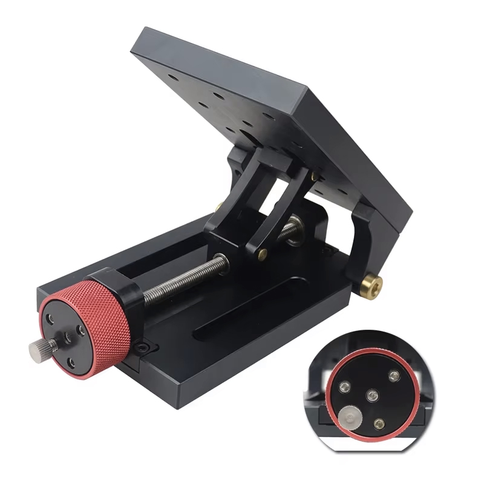
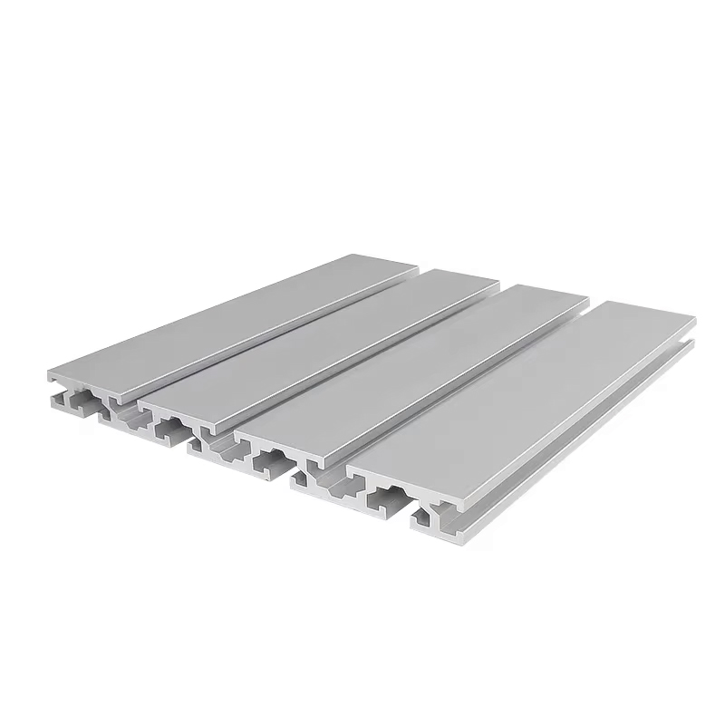
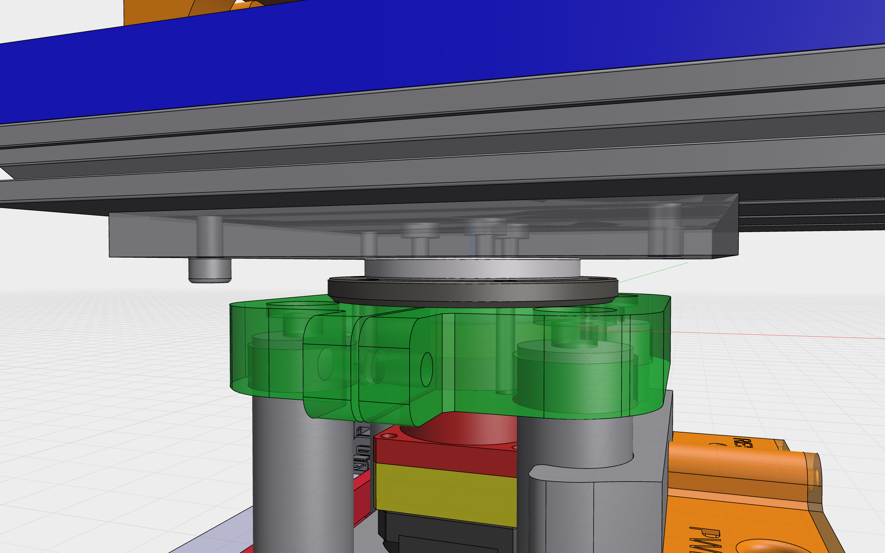

# Polar Align System – Hardware Setup

## ⚠️ Disclaimer

> I'm just an enthusiast sharing this open hardware project, **with no guarantee of success**.
> I’ll do my best to support others trying this build, but my **time is limited**, and my **skills are not professional-grade**.
> This is an **early prototype** and proof of concept — not fully validated yet. I hope to share updated iterations in the future.

## 🧩 3D Model & Files

- The full 3D design is available here:
  👉 [Shapr3D Project Viewer](https://app.shapr3d.com/v/EaET3sDOzzE1rERJT5Xg-)

- All 3D parts (STEP format) are included in the downloadable archive:
  📦 `PolarALIGN_V2_STEP.zip`

---

## 🛒 Mechanical Components (Major)

### 1. Tripod Extension
- Example: [AliExpress – 43€](https://fr.aliexpress.com/item/1005008669077575.html)
- 

### 2. Harmonic Drive (AZM Reduction)
- Model: **MINIF11-100** (Ratio 100:1)
- Example: [AliExpress – 58€](https://fr.aliexpress.com/item/1005007712296652.html)
- 

### 3. Stepper Motor (AZM Drive)
- **1x** Standard NEMA 17 for the Harmonic Drive input.
- Model: **17HS19-2004S1** (or similar high torque)
- Example: [Amazon – ~12€]
- 

### 4. Heavy Duty Tilt Plate (Base Structure)
- *Replaces the old cross-slide table for better stability.*
- Example: [AliExpress – ~80€](https://fr.aliexpress.com/item/1005009718898462.html)
- 

### 5. ALT Worm Gear Motor (Self-Locking)
- Model: **NEMA17 + 5840 Worm Gearbox** (Self-locking/Autobloquant)
- Prevents the mount from dropping under gravity.
- Example: [AliExpress – ~20€](https://fr.aliexpress.com/item/1005008325671689.html)
- 

### 6. Structural Profile
- Type: **15180 Aluminum Extrusion**
- Length: **250mm**
- Used for the main chassis rigidity.
- Cost: ~20€
- 

### 7. Orientation Ring (Bearing)
- **Reference**: [igus PRT-02 LC J4](https://www.igus.fr/product/iglidur_PRT_02_LC_J4) (~63€)
- 

---

## ⚡ Electronics & Control

### 8. Main Controller Board
- Board: **FYSETC E4 V1.0** (⚠️ **Pin mapping differs** on V2.0!)
- Features: WiFi + Bluetooth, 4x TMC2209, 240MHz.
- Example: [AliExpress – ~30€](https://fr.aliexpress.com/item/1005001704413148.html)
- 

### 9. Homing & Control
- **Homing Sensor (ALT):** Model **V-156-1C25** (Long lever microswitch) – *< 2€*
- **Home Button:** Metal Push Button (1NO, High head).
  - Specs: Waterproof, LED (3-24V), Latching/Reset, 12mm or 16mm.
  - Material: Nickel-plated Brass – *< 2€*

---

## 🔩 Small Hardware & Fasteners

To complete the assembly, you will need the following "vitamins":

### Coupler (Crucial)
- **Type:** Rigid Clamping Coupler (D25L35)
- **Size:** **6mm to 8mm** (Connects T6 Screw to 8mm Motor Shaft)
- *Note: Do not use flexible spider couplers or set-screw couplers.*
- Example: "OKE DE-Couremplaçant Personnalisé à Arbre Rigide" – *~3.50€*

### Screws & Nuts
- **Sliding T-Nuts:** M6 for 15180 profile (Pack of 200) – *~7€*
- **Assorted Screws:** M3, M4, M5, M6 (Various lengths: 10mm to 40mm) – *~20€ total*

---

### 💰 Estimated Total: ~**360€ - 380€**

*(Excluding 3D printing filament)*

---

## 🖨️ 3D Printing & Fabrication

- **Material:** All 3D parts printed in **PLA (100% infill)** for maximum stiffness.
- **CNC Machining (Recommended):**
  - For heavy payloads (>10kg), it is highly recommended to CNC machine the load-bearing parts (green in the image below) connecting the Tilt Plate to the Orientation Ring.
  - Estimated CNC cost: ~**90€**
- 

### 🧮 Total Budget (with CNC)
- ~370€ Hardware
- + ~90€ CNC Parts
- 🟰 **~460€ Final Project Cost**

---

## 🔌 Wiring & Configuration (CRITICAL)

### ⚠️ Jumper Configuration (The "Address" Trap)
Unlike OnStep or standard 3D printer setups, this firmware uses a **Shared UART Bus**.
You **MUST NOT remove all jumpers**. You need to assign unique addresses to the drivers so the ESP32 can talk to them individually.

Located under the TMC2209 drivers, set the jumpers (MS1/MS2) as follows:

| Axis | Socket | Target Address | Jumper Configuration |
| :--- | :--- | :--- | :--- |
| **AZIMUTH** | X (or 1) | **1** | MS1: **ON** (High) / MS2: **OFF** (Low) |
| **ALTITUDE** | Y (or 2) | **2** | MS1: **OFF** (Low) / MS2: **ON** (High) |
| *(Unused)* | Z / E | - | Remove drivers/jumpers |

### Wiring Resources
- **FYSETC Wiki (E4 Board)**: [https://wiki.fysetc.com/docs/E4](https://wiki.fysetc.com/docs/E4)
- *Note on OnStep guides:* You may find wiring diagrams for OnStep on the web. You can use them to locate pins (5V, GND, Endstops), but **DO NOT follow their jumper/firmware instructions**.

---

## 📸 Assembly Photos

You can find detailed images in the `/IMAGES/ASSEMBLY` folder of this repository.
