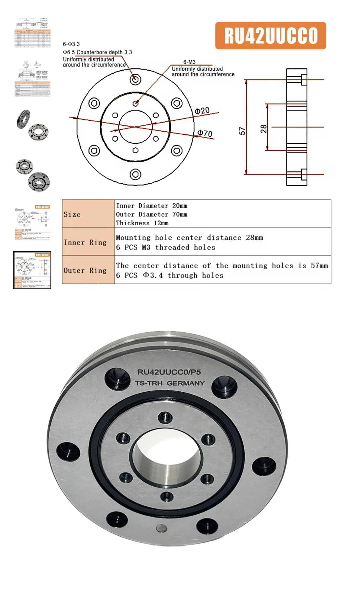
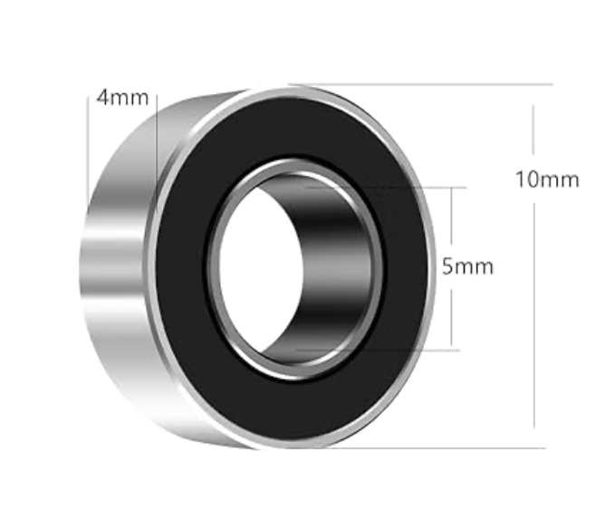
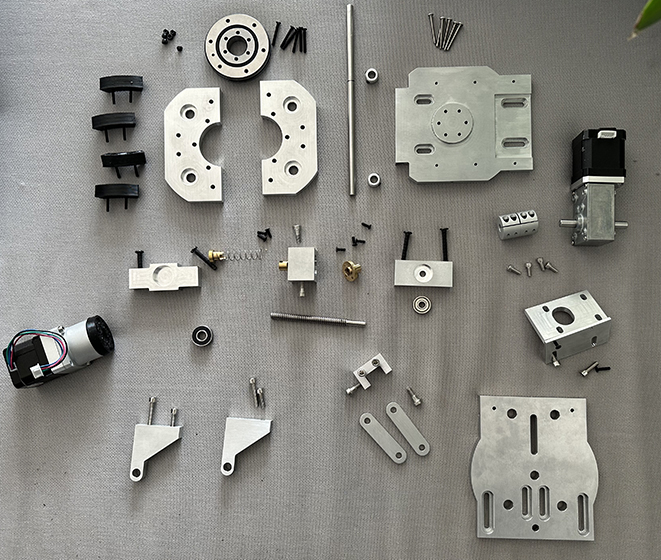
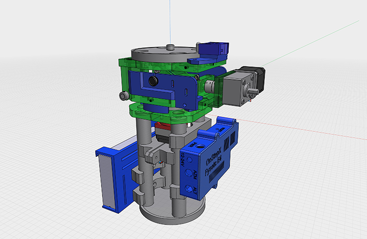
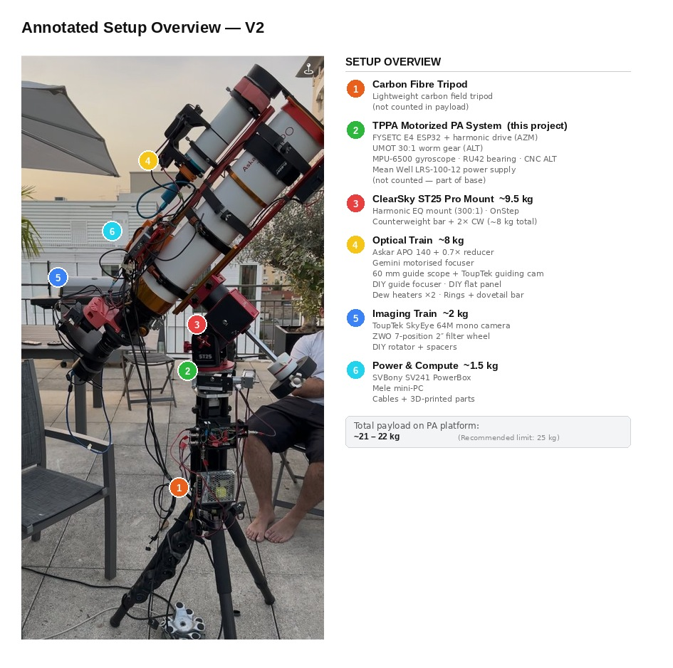
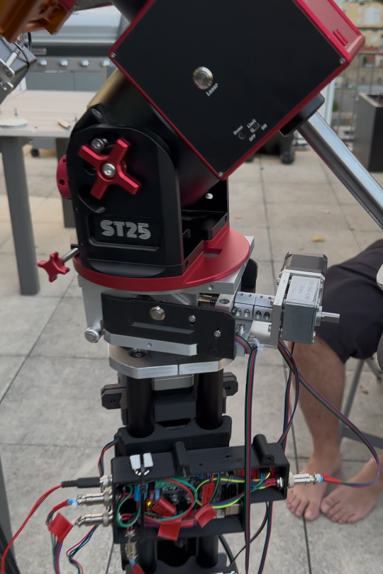

# Polar Align System – Hardware Setup (V2)

> 🔧 **This document covers the V2 hardware revision**, which uses a custom CNC ALT bielle mechanism and an RU42 crossed roller bearing for the AZM axis. All parts have been delivered, assembled, and the system is currently **under field testing**.
>
> For a proven, ready-to-build starting point, see [`HARDWARE_Prototype.md`](./HARDWARE_Prototype.md).
> Use `PolarAlign_auto.ino` (unified firmware) and select profile `2` (V2) at first boot.

---

## ⚠️ Disclaimer

> I'm just an enthusiast sharing this open hardware project, **with no guarantee of success**.
> I'll do my best to support others trying this build, but my **time is limited**, and my **skills are not professional-grade**.
> V2 is fully assembled and under active testing. Field results and corrections will be published here as they come in.

---

## 🧭 What's Different in V2?

V2 addresses the two main limitations of the Prototype:

| Axis | Prototype | V2 | Benefit |
|------|-----------|-----|---------|
| **AZM bearing** | igus PRT-02 LC — tilting moment unknown (⚠️ assumed weakest link) | **RU42 crossed roller** — tilting moment ~153 Nm (4.1× margin at 25 kg) | Known, published margins. No more uncertainty. |
| **ALT mechanism** | Commercial tilt plate (5.6 mm non-standard shaft, custom coupler) | **Custom CNC ALT bielle** — pivot below T8, optimized kinematics | Full 12° travel range, clean geometry, no off-spec shafts. |
| **Base plate** | Monolithic 15180 aluminium profiles | **Two-piece CNC aluminium** — assembly tolerance on 4 pillars | Adjustable at assembly, lower JLCCNC cost. |

All electronics, firmware logic, MPU wiring, and GRBL protocol are **identical to the Prototype**. Only the hardware constants differ — the firmware handles both via runtime profile selection.

---

## 🧩 3D Model & Files

- Full 3D design (STEP format): 📦 `PolarALIGN_V2_STEP.zip`

> 💡 All CNC part dimensions are directly readable from the STEP file. The sections below describe architecture and design rationale; refer to the STEP for fabrication tolerances and exact dimensions.

> ⚠️ **Manufacturing drawings** (2D technical PDFs as submitted to JLCCNC) are available in `3D STEP Models/Manufacturing_Drawings_V2/`. These reflect the design **as fabricated**. If the design is revised post-validation, the STEP file is the source of truth.

- 👉 [Shapr3D Project Viewer](https://app.shapr3d.com/p/c5be962f-1274-4f6f-9b4a-4f21080a35d3) — parts in **green**: CNC aluminium; parts in **blue**: 3D-printed.

- 🎬 **Kinematic simulation (Fusion 360):** [V2 ALT Bielle — Full Travel Range](https://youtu.be/YnkVJ2hzqB0) — bielle mechanism sweeping −2° to +10°, pivot geometry and T8 drive in motion.

- 🎬 **First real-world stress test:** [V2 in the Real World](https://youtube.com/shorts/aVQfPjl87hA) — V2 CNC assembly under full load.

---

## ⚖️ Mechanical Design — Load Path

### AZM Axis (Azimuth)

```
Telescope + EQ Mount
       ↓
  ALT CNC mechanism (tilt plate + bielle)
       ↓
  Two-piece CNC base plate
       ↓
  RU42 crossed roller bearing (inner ring fixed, outer ring rotates)
       ↓
  MiniF harmonic drive 100:1 (drives outer ring via 3D-printed adapter)
       ↓
  Angeleyes 400 tripod extension / pier
```

**Every component in the load path is metal.** The only 3D-printed part in this chain is the harmonic drive adapter (motor torque only — no telescope load).

---

## 🔩 AZM Axis: RU42 Crossed Roller Bearing

### Why crossed roller instead of slewing ring?

The igus PRT-02 LC (Prototype) is a polymer slewing ring with unpublished tilting moment for its LC variant — the single biggest uncertainty in the Prototype's payload analysis. The RU42 replaces it with a precision steel crossed roller bearing with known, published ratings.

| Parameter | igus PRT-02 LC | RU42 (V2) |
|---|---|---|
| Type | Polymer slewing ring | Steel crossed roller |
| OD | 80 mm | 70 mm |
| Dynamic axial | 4,000 N (16×) | 7,350 N **(30×)** |
| Tilting moment | ⚠️ **Unknown** (LC variant) | ~153 Nm **(4.1× at 25 kg)** |
| Axial play | ±0.25 mm | ≤0.03 mm (P5 precision) |
| Maintenance | None (polymer) | Grease via lubrication hole (Ø3.1mm) |
| Cost | ~63€ | **~38€** |

> **Tilting moment calculation:** C = 7,350 N × dp/2 = 0.02075 m → **153 Nm**. At 25 kg with a 150 mm eccentric arm: 37 Nm → **4.1× SF**. Static rating (C₀ = 8,350 N) gives 173 Nm (**4.7×**).

> **Comparison:** The igus PRT-01-20 (the published upgrade path for the Prototype) is rated at 120 Nm (3.3× SF). The RU42 exceeds this at lower cost and smaller footprint.

### RU42 Full Specifications

| Parameter | Value |
|---|---|
| **Model** | RU42UUCCO (P5 precision, sealed both sides) |
| **Inner diameter (d)** | 20 mm |
| **Outer diameter (D)** | 70 mm |
| **Width (B)** | 12 mm |
| **Roller pitch circle (dp)** | 41.5 mm |
| **Dynamic radial rating (C)** | 7.35 kN |
| **Static radial rating (C₀)** | 8.35 kN |
| **Mass** | 0.29 kg |
| **Precision** | P5 |
| **Lubrication hole** | Ø3.1 mm |

**Mounting holes:**

| Ring | PCD | Holes | Type |
|---|---|---|---|
| **Inner ring** | 28 mm | 6× M3 | Threaded through — fixed to base plate |
| **Outer ring** | 57 mm | 6× Ø3.4 | Through + Ø6.5 counterbore, depth 3.3 mm — rotating platform (telescope side) |

- 

### Harmonic Drive Adapter

A 3D-printed PLA+CF adapter bridges the harmonic drive output (PCD = 20.5 mm) to the RU42 outer ring (PCD = 57 mm, Ø3.4 holes). The adapter carries **motor torque only** — no telescope load passes through it.

---

## 🔩 AZM Axis: Base Plate (Two-Piece CNC)

The V2 base replaces the Prototype's monolithic 15180 aluminium profiles with two CNC-machined aluminium plates joined by four precision pillars.

**Design rationale:**
- **JLCCNC cost:** Two separate small blocks are significantly cheaper than a large monolithic part.
- **Assembly tolerance:** The four pillars allow fine parallelism adjustment during assembly, compensating for minor CNC flatness variation.
- **Anti-tip gap:** A 1 mm gap between the two plates on the anti-tip side prevents binding during AZM rotation under eccentric load.

**AZM adjustment interface:**
- Central M8 bolt fixes the Angeleyes 400 tripod extension (universal mount interface).
- A radial sliding slot accommodates an 8×16 shoulder screw (M6×8) as the AZM fine-adjustment pin during polar alignment.

> 📐 Refer to `PolarALIGN_V2_STEP.zip` for all CNC dimensions, tolerances, and hole patterns.

---

## 🔧 ALT Axis: CNC Bielle Mechanism

The V2 ALT axis replaces the commercial tilt plate with a fully custom CNC aluminium bielle (crank-arm) mechanism. The key design insight: **pivot repositioned below the T8 lead screw** — this dramatically improves mechanical advantage and recovers the full travel range that was lost in earlier geometry iterations.

### Geometry (Geometry V3 — validated in simulation + fabricated)

| Parameter | Value |
|---|---|
| Pivot position | (0, 0) — reference origin |
| T8 screw position | Y = +17.5 mm above pivot |
| Ball joint upper (BH) | (58, 40.25) mm |
| T8 nut attachment (BB) | (97.54, 17.5) mm |
| Bielle length (L) | 45.6 mm |
| Left bearing (Palier G) | X = −19 mm |
| Right bearing (Palier D) | X = +127.07 mm |
| Travel range | −2° to +10° |
| Linear course | 17.59 mm over 12° |
| Effective mm/° (linearized) | 1.466 mm/° at mid-travel |

> 💡 **Why pivot below T8?** Earlier designs (V1, V2) placed the pivot above the T8 axis. This created a kinematic configuration where travel range degraded sharply. Moving the pivot below the T8 (V3 geometry) restores full 12° range and reduces peak T8 forces by ~3× compared to the above-pivot configuration.

### Structural Margins

| Component | Specification | Actual load | Safety Factor |
|---|---|---|---|
| T8 axial force | ~500–1,000 N (bronze nut) | **245 N @ −2°** | **2–4×** |
| Bielle (rod) | Steel, 5.6 mm² section | ~11 N compression | **20.7×** |
| UMOT 30:1 output torque | ~2–4 Nm | ~0.04 Nm required | **51×** |

### Right Bearing (Palier D): 626ZZ

The right-side bearing seat carries the T8 axial reaction force.

| Parameter | Value |
|---|---|
| Type | 626ZZ (6×19×6 mm) |
| Shaft | Ø6 mm, with Ø8→Ø6 shoulder |
| Axial stop | Shoulder against bearing inner ring (metal-on-metal — not aluminium) |
| Axial clearance | 0.5 mm |
| Through-hole in aluminium | Ø6.5 mm |
| Combined axial/radial SF | 5.3× |

> ⚠️ **Critical assembly note:** The Ø8→Ø6 shoulder must bear against the **inner ring** of the 626ZZ, not the aluminium housing. Aluminium is too soft to serve as an axial stop under repeated T8 load cycles.

- 

### Chariot (T8 Nut Carrier)

The T8 nut carrier uses **two large nuts**, one on each side of the chariot body, both fixed to the chariot:

| Position | Nut | Role |
|---|---|---|
| Left | Large nut, fixed to chariot | Axial stop for rightward T8 forces |
| Right | Large nut, fixed to chariot | Axial stop for leftward T8 forces |

> ⚠️ **Design change vs original spec:** The three-nut anti-backlash system (spring + secondary nut) was removed. The spring assembly created a collision with the left bearing (Palier G) at the end of travel. The current two-nut design eliminates the collision and is sufficient given the T8 mesh quality and the MPU learning system's ability to compensate for any residual backlash effect.

### Firmware Profile for V2

```cpp
// V2 profile — set automatically when profile '2' is selected at first boot
constexpr float  ALT_MOTOR_GEARBOX  = 124.0f;  // Initial estimate — ML converges to true value within 2–3 jogs
constexpr bool   AXIS_REV_ALT       = false;    // Prototype is true, V2 is false
constexpr float  HOME_TRIGGER_ANGLE = -2.0f;    // ALT homes to −2° (limit switch position)
constexpr float  ALT_LIMIT_NEG      = -2.0f;    // Travel limit matches home position
constexpr float  ALT_LIMIT_POS      = 10.0f;    // Max tilt
```

> ⚠️ The `ALT_MOTOR_GEARBOX` value of 124 is a terrain-validated starting estimate. The MPU-6500 ML system will converge to the true ratio within 2–3 ALT jogs and save it to EEPROM. The ±20% acceptance band gives the learning system room to work regardless of exact geometry.

> 💡 **GUI users:** In the **Firmware Config tab**, select the **V2 CNC** profile at startup. `TILT_CRANK_RATIO` is pre-set to the correct value. No manual entry needed.

---

## ⚡ Electronics & Wiring

Electronics are **identical to the Prototype** for all shared components. The sections below cover the complete wiring for V2.

### Controller Board: FYSETC E4 V1.0

| Spec | Value |
|------|-------|
| MCU | ESP32-WROOM-32 @ 240 MHz |
| Drivers | 4× TMC2209, UART-addressed |
| Used channels | MOT-X (Azimuth) + MOT-Y (Altitude) |
| Power input | 12 V DC |

> ⚠️ **FYSETC E4 V1.0 only!** V2.0 has different pin mapping — not compatible.

### Motors

| Axis | Port | Mode | µstep | Run current | Hold current | Note |
|------|------|------|:-----:|:-----------:|:------------:|------|
| AZM | MOT-X | SpreadCycle | 16 | 600 mA | 300 mA | Harmonic drive is not self-locking — active hold required |
| ALT | MOT-Y | SpreadCycle | 4 | 300 mA | 30 mA | T8 screw is self-locking — hold current irrelevant |

> **AZM motor (V2):** 17HS19-2004S1 — identical to Prototype. Parameters unchanged.

> **Why SpreadCycle on both axes?** SpreadCycle provides firmer, more predictable holding torque than StealthChop on the AZM harmonic drive. The perceived AZM "soft zone then hard stop" at rest is intrinsic flex-spline elastic behavior, not a current issue — SpreadCycle is retained regardless as it improves static holding stiffness.

### Power Supply

| Parameter | Value |
|---|---|
| **Model** | Mean Well LRS-100-12 |
| **Output** | 12 V DC, 8.5 A (100 W) |
| **Cooling** | Passive (no fan) — no noise during sessions |
| **Headroom** | ×2.4 over peak draw (~3.5 A) |
| **Cost** | ~18€ |

> 💡 **Why LRS-100-12 and not LRS-75-12?** At only 3€ more, the 100W model provides ×2.4 headroom (vs ×1.8) while remaining fully passive. The 150W model has a thermostatically controlled fan — unwanted noise outdoors at night. The 100W is the sweet spot: silent, sufficient margin for future additions (Raspberry Pi, dew heaters, additional axes).

### Safety Inputs

| Function | GPIO | Header | Type |
|----------|:----:|--------|------|
| ALT Limit Switch | 34 | X-MIN | Input only, active LOW |
| Home Button | 35 | Y-MIN | Input only, active LOW |

### Full GPIO Map

| Signal | GPIO | E4 silkscreen |
|--------|:----:|---------------|
| STEP AZM | 27 | MOT-X |
| DIR AZM | 26 | MOT-X |
| EN (both) | 25 | /ENABLE |
| UART RX/TX | 21/22 | Shared bus (Addr 1=AZM, Addr 2=ALT) |
| STEP ALT | 33 | MOT-Y |
| DIR ALT | 32 | MOT-Y |
| SCL | 18 | SD Card `SCK` |
| SDA | 19 | SD Card `MISO` |
| Limit switch | 34 | Z-MIN |
| Home button | 35 | Y-MIN |

### UART Jumper Setup

To enable TMC2209 communication, place **2 jumper caps** on the TXD/RXD header. Without them, motors won't respond. See [FYSETC E4 Wiki](https://wiki.fysetc.com/docs/E4) for placement.

> Driver addressing: AZM (Driver X) = Address 1 / ALT (Driver Y) = Address 2.

### MPU-6500 I2C Wiring (via SD Card Sniffer)

Insert the TF/microSD sniffer board into the FYSETC E4's SD card slot, then wire the MPU-6500:

| Wire Color | Signal | Sniffer Pin | ESP32 GPIO |
|:----------:|--------|:-----------:|:----------:|
| 🔴 Red | VCC | 3.3V | — | **3.3V only — do not use 5V** |
| 🟡 Yellow | GND | GND | — | |
| 🔵 Blue | SCL | SCK | GPIO 18 | |
| 🟢 Green | SDA | MISO | GPIO 19 | |

> ⚠️ Keep I2C wires away from stepper motor cables to prevent EMI. The firmware detects I2C failures and reports them via `DIAG`.

---

## ⚖️ Payload Rating (V2)

The RU42 crossed roller bearing eliminates the tilting moment uncertainty that capped the Prototype at 20 kg.

| Rating | Max Payload | Notes |
|---|---|---|
| **Recommended** | **25 kg** | Full 4.1× safety margin on tilting moment. |
| **Advanced** | **30+ kg** | Requires centered payload; ALT mechanism margins remain >20×. Bearing is not the limiting factor. |

**Full margin table at 25 kg:**

| Component | Capacity | Load @25 kg | Margin | Limiting? |
|---|---|---|---|---|
| RU42 – Axial dynamic | 7,350 N | ~245 N | **30×** | No |
| RU42 – Tilting moment (est.) | ~153 Nm | ~37 Nm @150mm arm | **4.1×** | ⚠️ Weakest (but known & comfortable) |
| T8 lead screw (bronze nut) | 500–1,000 N | ~25–40 N @2° tilt | **15–25×** | No |
| UMOT 30:1 output torque | ~2–4 Nm | ~0.04 Nm @operating angle | **51×** | No |
| Bielle (CNC aluminium rod) | SF 20.7× | 11 N compression | **20.7×** | No |
| 626ZZ right bearing | Combined SF 5.3× | Axial reaction only | **5.3×** | No |
| 3D-printed parts | Non-structural | Motor/sensor weight only | N/A | No |

> 💡 **Counterweights lower the effective centre of gravity.** If your EQ mount uses a counterweight bar, the counterweights hanging below the RA axis reduce the effective torque arm seen by the ALT mechanism — a 32 kg setup (mount + scope + 8 kg counterweights) behaves mechanically closer to a 20 kg unbalanced load. Always calculate your payload budget using the **full assembly** (mount + scope + counterweights + accessories), not scope alone.

> ⚠️ Margin values above are simulation-derived. Field validation is in progress and will update this table.

---

## 🌡️ Motor Thermal Management

The UMOT worm gearbox encloses the NEMA 17 in a compact housing with poor heat dissipation. The firmware ships with 300 mA for ALT — the only safe value for PLA+ motor cradles.

| RMS Current | Power | Temperature | PLA-safe? |
|:-----------:|:-----:|:-----------:|:---------:|
| 800 mA (old default) | ~1.6 W | 55–65°C | ❌ |
| **300 mA (default)** | ~0.2 W | Barely warm | ✅ |
| 400 mA (cold weather) | ~0.4 W | ~35°C | ✅ |

> Use **PETG** or **ABS** for the ALT motor cradle above 300 mA.

---

## 🖨️ 3D Printing & CNC Fabrication

### CNC Parts (aluminium, JLCCNC)

| Part | Role | Structural? |
|---|---|---|
| Base plate — piece 1 | Lower platform, tripod interface, RU42 outer ring mount | ✅ Yes |
| Base plate — piece 2 | Upper platform, RU42 inner ring mount, pillar tops | ✅ Yes |
| ALT tilt plate assembly | Bielle mechanism, pivot, 626ZZ seats, chariot guide | ✅ Yes |

- 
- 

> Standard tap drill sizes: M3=2.5mm, M4=3.3mm, M5=4.2mm, M6=5.0mm. All dimensions in `PolarALIGN_V2_STEP.zip`.

Estimated CNC cost (JLCCNC): **~320€**

### 3D Printed Parts

None are in the telescope load path.

| Part | Material | Note |
|---|---|---|
| Harmonic drive adapter (AZM) | PLA+CF | Motor torque only — no telescope load |
| ALT motor cradle (UMOT) | PLA+CF (PETG if >300 mA) | Direct contact with UMOT housing |
| MPU-6500 bracket | PLA | Negligible load |
| Homing switch bracket | PLA | Negligible load |
| FYSETC E4 enclosure | PLA | Electronics housing only |

---

## 🛒 Parts List & Cost Estimate

### V2-specific components (replaces or new vs Prototype)

| # | Component | Change | Est. Cost |
|---|---|---|---|
| — | ~~igus PRT-02 LC J4~~ | **Removed** | — |
| — | ~~T8 coupler (5.6mm hack)~~ | **Removed** — V2 is native T8 | — |
| — | ~~15180 aluminium profiles~~ | **Removed** — replaced by CNC base plates | — |
| 1 | **RU42UUCCO** crossed roller bearing | New — AZM bearing | ~38€ |
| 2 | **CNC ALT** tilt plate assembly | New — replaces commercial tilt plate | ~320€ (JLCCNC) |
| 3 | **626ZZ** bearing (6×19×6 mm) | New — right-side T8 axial stop | <2€ |
| 4 | **Mean Well LRS-100-12** power supply | New — 12V 8.5A passive PSU | ~18€ |

### Shared components (identical to Prototype)

| Component | Est. Cost |
|---|---|
| Tripod extension (Angeleyes 400 or equivalent) | ~43€ |
| Harmonic drive MiniF11-100 (100:1) | ~58€ |
| NEMA 17 motor — AZM (17HS19-2004S1) | ~12€ |
| NEMA 17 + UMOT worm gearbox 30:1 — ALT | ~20€ |
| FYSETC E4 V1.0 controller board | ~30€ |
| MPU-6500 gyroscope | ~3€ |
| MicroSD card sniffer (I2C hack) | ~3€ |
| T8×2mm lead screw kit (screw + nut + KP08 bearings) | ~15€ |
| Limit switch (V-156-1C25) + home button | ~4€ |
| Assorted screws, fasteners, T-nuts | ~20€ |
| **Shared subtotal** | ~**208€** |

### 💰 Complete V2 Budget

| Category | Cost |
|---|---|
| V2-specific: RU42 bearing | ~38€ |
| V2-specific: CNC parts (JLCCNC) | ~320€ |
| V2-specific: 626ZZ bearing | ~2€ |
| V2-specific: Mean Well LRS-100-12 | ~18€ |
| Shared components | ~208€ |
| **Total** | ~**586€** |

*(Excluding 3D printing filament)*

> The Prototype costs ~490€ (including CNC junction plates). V2 costs more primarily due to the full CNC ALT mechanism (~320€ vs ~90€ for the Prototype's two junction plates). The RU42 bearing actually saves ~25€ vs the igus PRT-02 LC.

---

## 📸 Assembly Photos

### Annotated Setup Overview





You can find 3D model assembly views in `IMAGES/ASSEMBLY_V2/3D_Model/`.

---

## 📄 License

**MIT License** — do whatever you want, just keep the header.

---

*Maintained by Antonino Nicoletti — clear skies!*
