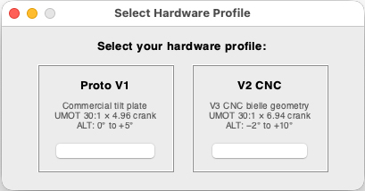
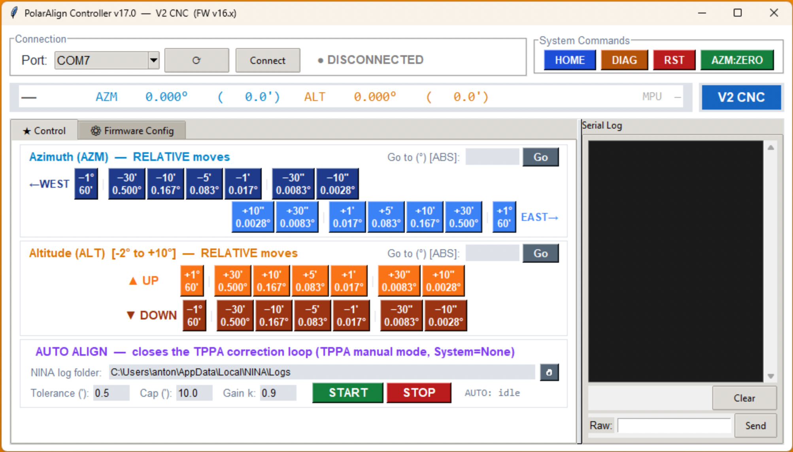

# Serial Alt‑Az Polar Alignment Controller (ESP32 / GRBL / MPU-6500)

Welcome to what is likely **the world's first motorized Polar Alignment mount featuring an active Gyroscopic Machine Learning ratio adaptation.**

A minimal **GRBL‑style** firmware + hardware platform designed to drive a two‑axis (Azimuth & Altitude) mount during polar‑alignment routines such as **TPPA** in **N.I.N.A.** It sits **between the tripod and the equatorial mount**, adding motorized azimuth and altitude correction capability to any existing setup. It runs on the *FYSETC E4 V1.0* (ESP32 + dual TMC2209) and emulates the Avalon UPAS protocol using a **non‑blocking motion engine**.

> 🏆 **Field-tested: < 0.2 arcminute polar alignment error** in ~15 iterations, 20 kg payload. **In routine use, aim for < 1 arcmin** — TPPA's adaptive controller can destabilize convergence below that threshold under average seeing.

---

## 🔀 Two Hardware Versions, One Firmware

This project supports two hardware configurations. A **single firmware binary** handles both — you select the profile once at first boot via the serial monitor. No recompile needed.

| | **Prototype** | **V2** |
|---|---|---|
| ALT axis | Commercial tilt plate + T8 lead screw | Custom CNC ALT bielle mechanism |
| AZM bearing | igus PRT-02 LC J4 slewing ring | RU42 crossed roller bearing |
| Base | Monolithic 15180 aluminium profiles | Two-piece CNC aluminium plates |
| Firmware profile | `1` — PROTO | `2` — V2 |
| `ALT_MOTOR_GEARBOX` | 148.8 (UMOT 30:1 × 4.96 crank) | ~124 (initial estimate — ML converges within 2–3 jogs) |
| ALT travel | 0° to +10° (homes at the bottom) | −2° to +10° (mechanical limit) |
| ALT home / limit switch | Physical limit switch at **0°** | Physical limit switch at **−2°** |
| AZM travel | ±30° (firmware limit) | ±30° (firmware limit) |
| Status | ✅ **Field-validated** | 🔧 **Delivered & under testing** |
| Estimated cost | ~**490€** | ~**586€** |
| Hardware docs | [`HARDWARE_Prototype.md`](./HARDWARE_Prototype.md) | [`HARDWARE_V2.md`](./HARDWARE_V2.md) |

> 💡 First build? **Start with the Prototype.** Off-the-shelf parts, validated to < 0.2 arcmin under 20 kg, identical firmware.

### ⚖️ Payload

| | Prototype | V2 |
|--|:---------:|:--:|
| Recommended | **20 kg** | **25 kg** |
| Advanced | 25 kg | 30+ kg |

> 💡 **Counterweights lower the effective CG.** A 32 kg setup (mount + scope + 8 kg counterweights) applies mechanically closer to a 20 kg unbalanced load on the ALT mechanism — a net positive for safety margins. Always budget for the **full assembly weight**, not scope alone.

---

## Why It Works

Most motorized polar alignment projects stop at "move a motor when TPPA says so." This one goes further on three fronts:

**🧠 It learns — where a sensor actually observes it.** After every ALT move, the MPU-6500 gyroscope measures the real physical movement and silently refines the ALT steps-per-degree ratio (EWMA, saved to EEPROM). The mount gets more accurate with every session. The AZM axis is *not* learned: since **v16.00** its ratio is frozen at the machined theoretical value (888.889 steps/deg for the 100:1 harmonic drive). See [What's new in v16.00](#-whats-new-in-v1600) — the AZM estimators were removed after a full audit showed they were tracking plate-solve noise, not mechanics.

**⚡ It never blocks.** The entire firmware is a non-blocking state machine. Motor pulses, gyroscope sampling, settle timers, and serial communication are all interleaved — N.I.N.A. polls status 10×/second and never gets a timeout. No `delay()` anywhere in the motion path.

**🔬 It understands TPPA.** The firmware knows that TPPA's `GearRatio` is not a physical gear ratio but a scaling multiplier between the plugin's internal nudge units and the arcminutes it puts on the wire — set it to **1** and read [the settings section](#-the-tppa-settings-we-recommend-read-this-first--it-will-save-you-hours) for why. The `Speed` parameter is not a setting at all here: the `$J=` parser reads only `X` and `Y` and never looks at `F`, so real speed is fixed by the profile's cruise step interval (`cfg_RAMP_CRUISE_ALT_US`: 120 µs on PROTO → ~481 arcmin/min, 150 µs on V2_CNC → ~462 arcmin/min). TPPA's adaptive controller (`AutomatedAdjustmentController`) builds a 2×2 response matrix and resets it when any corrective move worsens total error by more than 5% — which means backlash on direction reversals can indefinitely stall convergence. **v15.04 fixed this at the source**: the firmware injects dead steps on every direction reversal (both AZM and ALT). TPPA sees a clean linear response; the matrix stays intact. Since **v16.00** the ALT value is still auto-learned from the MPU (gated on ratio convergence, capped at 0.3°), while the AZM value is **set once by hand** with `BLC:AZM:<deg>` and persisted to EEPROM — the AZM auto-learner was removed because it had no sensor to observe and was estimating from plate-solve residuals.

| Feature | Detail |
|---------|--------|
| 🛡️ **Homing guard + DTR persistence** | TPPA jogs blocked until homing completes; homing state survives GUI reconnect |
| 🔘 **Physical HOME button + ALT limit switch** | Button triggers full homing sequence; limit switch defines mechanical zero (0° on Prototype, −2° on V2) |
| ⏱️ **Optimised timing** | RAMP_LENGTH = 500 steps, GLOBAL_SETTLE = 500 ms — inside N.I.N.A.'s 7 s timeout |
| 📐 **Arcminute protocol** | TPPA jogs (arcmin) ↔ internal degrees ↔ MPos reports (arcmin) — transparent to TPPA |

---

## 🆕 What's new in v16.00

v16.00 is the outcome of a **full critical audit of v15.04-p5** (four independent review passes over the whole firmware). It is field-validated on the Prototype. Nothing in the protocol, the wiring or the mechanics changed — the changes are all firmware-internal robustness, plus the removal of one subsystem that turned out to be measuring noise.

**Removed — AZM machine learning (ratio *and* backlash).**
The AZM axis has no sensor: both estimators inferred their value from TPPA's own correction residuals. The audit showed each was structurally biased rather than merely noisy. The ratio estimator was one-sided (overshoot evidence always landed in the reversal branch, which learns nothing), so it drifted monotonically to the +10 % acceptance-band edge. The backlash estimator had a leak equilibrium around ten times the input signal — with a 1′ signal floor and typical 2–3′ residuals it settled at 10–30′ of "backlash" that does not exist — and its ping-pong penalty fired on the perfectly normal sign alternation of TPPA corrections near convergence. The AZM harmonic drive is machined 100:1 and stable, so its ratio is now **frozen at the theoretical 888.889 steps/deg**. AZM backlash *compensation* is kept; the value is set once with `BLC:AZM:<deg>` and persisted. EEPROM slot 12 (AZM ratio) is retired.

**Kept and hardened — ALT learning.** ALT has a real MPU-6500 measurement behind it. Ratio learning is unchanged in principle; backlash learning is now gated on ALT ratio convergence (no cross-contamination while the ratio is still moving) and **decoupled from injection** — in p5 the `> 0` injection gate also controlled reversal detection, so once the learned compensation reached zero the firmware stopped noticing reversals at all and could never learn its way back.

**Robustness fixes.**

| Area | v15.04-p5 | v16.00 |
|------|-----------|--------|
| ALT ratio stability threshold | absolute, 0.5 steps/deg (≈ 8 ppm of 62 000) — never reachable, so `altRatioConverged` never latched, the fast-path optimisation was dead code and every ALT jog paid ~750 ms of observe | relative, 0.3 % of theoretical |
| MPU observe phase | an I²C failure mid-observe left the mount in `<Run>` forever | 3 s timeout → clean abort; 2 consecutive timeouts → MPU disabled for the session |
| Gyro tare failure at homing | homing "succeeded" with a bad tare | homing **fails**, no EEPROM magic written, stale magic invalidated; boot restore averages ~10 reads |
| `HOME` / `$H` during motion | the stale job resumed after homing and snapped to a pre-homing target in the *new* coordinate frame | active job + queue purged |
| First-boot profile menu | byte scan — latched on the first `1`/`2` in *any* traffic, including `$J=G91G21X…` | line-based (`1` or `2` + Enter); `PROFILE:RESET` now actually implemented |
| Realtime chars | `?` handling was bypassable when the `?` of `BLC?` arrived in a separate UART chunk | `?` only at line start, `!` `~` `0x18` anywhere, and no more `ok` reply to `!`/`~` |
| `diagLog` | filled after ~25 jogs and silently stopped | 4 KB **ring** buffer — `DIAG` shows the end of a long session |
| ALT backlash hardstop | 1.0° — 1° of dead steps takes 7.5 s with a frozen reported position, i.e. a guaranteed N.I.N.A. 7 s timeout | 0.3° (18′); a p5 value above it is **clamped, not discarded**, at upgrade |
| Ramp | resumed at full cruise speed after a pause | restarts after any pause > 20 ms (feed-hold resume, serial stall) |
| Status report | `<Idle\|MPos:a,b,0\|` | `<Idle\|MPos:a,b,0\|>` — properly closed |
| Unknown commands | silently ignored | `error:20 (unsupported: …)` |
| Driver enable | EN released before TMC2209 config | drivers held disabled until the UART config is applied |

> ✅ **Upgrading from v15.x is a plain reflash.** Keep `Erase All Flash Before Upload` **disabled** so the NVS profile survives. Your learned ALT ratio and backlash are preserved (an ALT backlash above 0.3° is clamped to 0.3°). The retired AZM ratio slot is simply ignored. **Do set your AZM backlash once** with `BLC:AZM:<deg>` — check the current value with `BLC?`.

### v16.01 → v16.03 — silencing the boot

Three point releases followed the audit, all aimed at one symptom: the first connection from the TPPA plugin failed every time, while the Python GUI connected on the first try. The cause was that opening the COM port reset the ESP32, and the boot text landed in the plugin's read buffer where its status parser tried to parse it.

**v16.01** moved every startup message into the `diagLog` ring buffer and left a single GRBL banner. **v16.02** made the handshake poll-aware and trimmed the startup delay. **v16.03** went the whole way — *machine-first boot*: no banner at all, an early `<Idle|MPos:0.000,0.000,0|>` probe frame about 50 ms after `Serial.begin`, and a real status frame at the end of `setup()`. The controller now emits nothing but valid GRBL frames, ever. See [Machine-first boot](#machine-first-boot-v1603).

The historic `status: M...` parse failure has not reappeared since v16.01. What remains — a first connection attempt that reports `Unable to find` — was traced to the plugin's port-scan path and is not a firmware problem; a terminal on the same port in the same conditions answers `?` instantly. It is documented with its workaround in Step 3 of the field section. **No further firmware iteration is warranted on it.**

---

## 🎬 See It In Action

| # | Video | What you'll see |
|---|-------|-----------------|
| 1 | [First Test with Full Payload](https://youtu.be/girvoCZ_UCE) | First motorized movements under real load. |
| 2 | [Homing Sequence](https://youtu.be/NkoLJ03FSSY) | Live serial: homing, limit switch, MPU-6500 tare. |
| 3 | [**TPPA Session — Below 0.2 Arcminute!**](https://youtu.be/gfE6sZmrzuw) | Complete TPPA run converging to < 0.2' in real-time. |
| 4 | [V2 ALT Bielle — Fusion 360 Simulation](https://youtu.be/YnkVJ2hzqB0) | Full −2° to +10° travel, pivot geometry, T8 drive. |
| 5 | [V2 in the Real World — First Stress Test](https://youtube.com/shorts/aVQfPjl87hA) | V2 CNC assembly under full load. |
| 6 | [**V2 Field Demo — TPPA Full Auto Session**](https://youtu.be/jZpT88h_pEg) | Complete TPPA automated polar alignment session on the V2 hardware in N.I.N.A. |
| 7 | [**V2 PA Session + Observation Session**](https://youtu.be/C0Mx80t3AEk) | PA session starting from a few arcmin error, followed by a full observation session — Askar APO 140 + reducer, 80 mm guide scope, SkyEye 62M, 7-position filter wheel, DIY rotator, ClearSky ST25 Pro. PHD2 guiding performance visible throughout. |

---

## I — Hardware

Full wiring, part references, mechanical assembly and CNC fabrication details are in the hardware docs:

- **Prototype:** [`HARDWARE_Prototype.md`](./HARDWARE_Prototype.md) — tilt plate, igus bearing, FYSETC E4 wiring, MPU-6500 SD card hack, UMOT 30:1
- **V2:** [`HARDWARE_V2.md`](./HARDWARE_V2.md) — CNC bielle mechanism, RU42 crossed roller bearing, Mean Well LRS-100-12 PSU

---

## II — Software

### Flash & Profile Selection

**1. Arduino IDE setup**

| Option | Value |
|--------|-------|
| Board | ESP32 Dev Module |
| CPU Freq | 240 MHz |
| Partition | **Huge APP (3 MB / 1 MB SPIFFS)** |
| **Erase All Flash** | **Disabled** ← critical for NVS persistence |

Install the *esp32* core (≥ v2.0.17) and the *TMCStepper* library, then flash `Arduino code/PolarAlign_auto.ino`.

**2. Profile selection at first boot**

Open Serial Monitor (115200 baud) — the firmware displays:

```
+---------------------------------------------------+
|  HARDWARE PROFILE NOT SET                         |
|  Required once after each firmware flash.         |
+---------------------------------------------------+
|  Send '1'  -> PROTO                               |
|  Send '2'  -> V2_CNC                              |
+---------------------------------------------------+
```

Send `1` or `2` **followed by Enter** — the selection is line-based since v16.00, and only an exact `1` or `2` line is accepted. Anything else is ignored, so connecting N.I.N.A. or the GUI before you have chosen can no longer pick a profile for you (in v15.x the reader latched on the first `1`/`2` byte of *any* traffic, and `$J=G91G21X…` contains both).

The board saves the profile to NVS and reboots. It survives all subsequent reflashes, **provided** `Tools → Erase All Flash Before Upload` = **Disabled**.

To change later: `PROFILE:RESET` (implemented since v16.00 — it was documented but missing in v15.x) — To verify: `DIAG`, which prints the active profile and every runtime `cfg_` value (`PROFILEINFO` was documented in v15.x but never existed)

---

### The GUI

`GUI/PolarAlignGUI_v16_00.py` controls the mount without N.I.N.A. — essential for bench testing, pre-alignment, and diagnostics.

<p align="center">
  
  &nbsp;&nbsp;
  
</p>
<p align="center"><em>Left: profile picker shown at startup (Prototype vs V2 CNC). Right: main controller window.</em></p>

**Run from source (Windows / macOS / Linux):**
```bash
pip3 install pyserial
python3 GUI/PolarAlignGUI_v16_00.py
```
> No pre-built executable. Python 3.8+ and pyserial are the only dependencies.

**Key panels:**
- **Jog controls** — AZM (West/East) and ALT (Up/Down) from ±1° down to ±10″, color-coded per axis (AZM blue, ALT orange)
- **Absolute positioning** — Go to any angle directly
- **Live position + Learning Monitor** — real-time AZM/ALT position, MPU error, learned ALT ratio (all in the top status bar). The AZM ratio/backlash learning readouts were removed in v16.00 along with the firmware subsystem behind them.
- **AZM backlash panel** *(new in v16.00)* — shows the firmware's current AZM compensation, with an arcmin entry + **Set** button (sends `BLC:AZM:<deg>`) and a refresh (sends `BLC?`). The GUI queries `BLC?` automatically ~1 s after connecting.
- **System commands** — HOME, DIAG, RST, AZM:ZERO in one click
- **Raw serial console** — send any command, see full log
- **Firmware Config tab** — edit hardware constants and generate ready-to-paste Arduino code
- **Last COM port remembered** between sessions (`~/.polaralign_gui.json`)

---

## III — In the Field

### Step 1 — Home

**Run `HOME` before every session.** Without homing, TPPA jogs are silently blocked (firmware replies `ok` but doesn't move).

What homing does: moves ALT down to the physical limit switch → safety pull-off (0.2°) → defines mechanical zero → tares the MPU-6500 → saves state to EEPROM → unlocks TPPA jogs.

> 💡 **Auto-recovery:** If the limit switch is already pressed at power-on, the firmware runs homing automatically.

---

### Step 2 — Pre-align with the GUI

Before launching TPPA in full auto mode, **use the GUI to get within ~1° of true polar alignment.** This pays dividends:

- TPPA's adaptive controller converges much faster from < 1° than from 3–5°
- Reduces the risk of hitting firmware travel limits (`AZM ±30°`, `ALT −2°/+10°`) mid-session
- Allows you to verify motor directions before handing control to TPPA

**Procedure:**
1. Connect the GUI, run `HOME`
2. **Set your EQ mount's latitude to your actual latitude minus ~1°.** This is important: the PA platform has only **−2° of downward ALT correction range** (V2) or 0° (Prototype, which homes at 0°). If your mount is set too high (ALT above your true latitude), TPPA will need to correct downward — and may hit the **mechanical travel limit** before converging. Setting the mount slightly low gives TPPA room to correct in both directions.
3. **Close the GUI**, then open TPPA in N.I.N.A. Go to **Options → Settings** (back-office) and run the connection test. It fails on the first attempt — a plugin-side issue, documented in Step 3. Run it a second time and it succeeds. Then close the back-office.
4. Launch TPPA in measurement-only mode (automated adjustments **OFF**): TPPA will plate-solve and display the current AZM and ALT polar error in real time.
5. **Reconnect the GUI** and use the jog buttons to apply corrections manually — exactly as you would turn the manual adjustment screws on a traditional mount. TPPA updates the error display after each plate-solve.
6. Iterate until you're within ~1° on both axes.
7. Close the GUI again, enable automated adjustments in TPPA and launch the full auto session.

> ⚠️ **The GUI and TPPA cannot share the serial port.** Always close one before opening the other. On most builds, opening or closing the port toggles DTR and reboots the ESP32, which clears the RAM diagnostic log — a 10 µF capacitor between EN and GND suppresses that reset if it bothers you. Since v16.03 a reboot no longer corrupts the connecting client's read either way: the board is silent at boot.

---

### Step 3 — TPPA Session

#### 🚨 The TPPA settings we recommend (read this first — it will save you hours)

Every value below was checked against the plugin's own source code (`isbeorn/nina.plugin.polaralignment`) and against this firmware. Where a setting has **no effect** — on this firmware, or at all — that is said plainly rather than left ambiguous. Knowing which knobs are inert saves a lot of pointless tuning in the dark.

**Avalon Polar Alignment System panel** — appears once `UPAS` is selected

| Setting | Recommended | Why |
|---------|:-----------:|-----|
| **Azimuth GearRatio** | **1** | This firmware speaks arcminutes natively on the wire, and the plugin's own footer note asks for exactly that: *"Make sure to set your gear ratio to achieve 1 arcminute per step for each axis!"* With `GearRatio = 1`, one TPPA unit = one arcminute. The plugin ships with `2` / `22` because a real Avalon reports raw motor steps — we don't. |
| **Altitude GearRatio** | **1** | Same reasoning, and it matters more on ALT — see the deadband discussion below. |
| **Azimuth / Altitude Speed** | `600` (any value works) | **The firmware ignores it.** The `$J=` parser reads only `X` and `Y`; the `F` field is never parsed. Real speed is fixed by the profile's cruise interval: ~16 875 ′/min AZM, ~481 ′/min ALT (PROTO) / ~462 ′/min (V2_CNC). Speed only feeds TPPA's *own* move timeout — `2 × distance/Speed × 60 + 5 s` — which at 600 stays comfortably above anything the mount actually needs. |
| **Azimuth backlash compensation** | **0 steps** | A non-zero value makes TPPA send a two-part jog `(−comp, +comp)` before the real move. This firmware already injects its own dead steps on every direction reversal — and it sees that pair as *two more* reversals. The result is triple compensation and a corrupted response matrix. Leave it at 0 and let the firmware do the job (`BLC?` / `BLC:AZM:<deg>`). |
| **Reverse Azimuth / Reverse Altitude** | whatever makes the manual nudge buttons move the right way | Far less critical than it looks in **automatic** mode: `AutomatedAdjustmentController` learns the sign of each axis from its own probe moves, so an inverted axis simply yields a negative matrix coefficient and the controller absorbs it. These toggles matter for the manual ±0.1 / ±1 / ±10 buttons, and cost at most one wasted probe iteration at the start of an auto run. |

**Options → Plugins → Three Point Polar Alignment**

| Setting | Recommended | Why |
|---------|:-----------:|-----|
| **Do automated adjustments** | **ON** | If OFF, TPPA measures and displays but sends no command at all. Motors never move. **Check this first.** |
| **Polar Alignment System** | `UPAS` | Selects the Avalon/GRBL dialect this firmware emulates. If motors never move, check this second. |
| **Automated adjustment settle time** | `3 s` | Seconds TPPA waits after each adjustment before the next solve. The firmware has its own 500 ms settle, but a tripod under 20 kg does not stop ringing that fast. 5 s is not harmful, only slow; below ~2 s you start plate-solving a moving image. |
| **Alignment Tolerance** | `0.5 arcmin` | Total-error threshold at which TPPA declares success. **Must be non-zero, or automated adjustments will not run at all.** Decimal values require plugin ≥ 2.2.6.4. In average seeing 0.5–1.0 is realistic; chasing 0.2 mostly makes the controller chase plate-solve noise. |
| **Default Target Distance** | `10°` | **This is the triangulation angle** — the RA separation between the three measurement points. Larger gives better geometry, but needs more clear sky and risks a bad solve field or a meridian problem. |
| **Default Search Radius** | `30°` | Plate-solve search radius — *not* a movement, and frequently confused with the setting above. It is **clamped to 30–180** in the plugin (`Math.Max(30, Math.Min(180, value))`), so anything below 30 silently becomes 30: the factory default of 10 is inert. Set 30 so the displayed value tells the truth. |
| **Default Move Rate** | `3 °/s` | Nothing to do with our board. This is the **mount's** RA rate, issued through ASCOM `MoveAxis`, used to slew between the three measurement points — and it is clamped to what your telescope driver advertises in `PrimaryAxisRates`. There is no reason to raise it for this hardware. |
| **Axis move timeout factor** | `2` | Multiplier on the computed RA-move timeout (distance ÷ rate × factor). Leave alone unless your mount is genuinely slower than its driver claims. |
| **East Direction** | either | Which side of the meridian the RA sweep goes to. Pick whichever gives you 10° of clear sky. |
| **Manual mode azimuth / altitude offset** | `1°` / `2°` | Only used when TPPA builds its own start coordinates instead of starting from the current pointing. Irrelevant to the full-auto flow described here. |
| **Refraction adjustment** | `OFF` | |
| **Continuous error estimator** | `OFF` | Flagged experimental in the plugin. Every field result quoted in this README was obtained with the legacy image-plane calculation. |
| **Auto pause** | `OFF` | Pauses TPPA after each continuous-correction update — the opposite of what you want in an unattended run. |
| **Log error** | `OFF` | Debug aid only. |
| **Stop tracking when done** | `ON` | |

> 💡 **Initial error alert.** If TPPA displays *"Initial Polar Alignment error is large. Correction phase will be unreliable."*, corrections still proceed as long as moves stay within firmware travel limits. Pre-aligning with the GUI avoids this.

#### Understanding GearRatio — the most misunderstood TPPA setting

> ⚠️ **`GearRatio` is not a physical gear ratio.** It is a pure scaling multiplier between the dimensionless "nudge units" TPPA's controller works in and the numbers it puts on the wire:
> ```
> value sent in $J=  =  nudge units × GearRatio     (arcminutes, for this firmware)
> ```

The controller learns the mount's *response* empirically — a 2×2 matrix in degrees of polar error per nudge unit — so GearRatio is not a calibration you can get "wrong" in an absolute sense: the loop adapts to whatever you set. What it does change is the **granularity** of every move, because the controller's own magnitudes are hard-coded (probe = 1.0, minimum = 0.05, maximum = 5.0 nudge units).

| GearRatio | Probe move | Max move / iteration | Deadband (below this, no move at all) | Manual buttons |
|:---------:|:----------:|:--------------------:|:-------------------------------------:|:--------------:|
| **1** | **1′** | **5′** | **0.05′** | 0.1 / 1 / 10′ |
| 2 | 2′ | 10′ | 0.1′ | 0.2 / 2 / 20′ |
| 5 | 5′ | 25′ | 0.25′ | 0.5 / 5 / 50′ |

**Use 1.** Three reasons, in order of importance:

1. It is what the plugin itself asks for — "1 arcminute per step" — and what this firmware's wire protocol already is.
2. **Coarse ALT moves fight the firmware's own feedback.** `ALT_TOLERANCE_DEG = 0.05°` = 3′: any ALT move above that threshold starts the MPU observe cycle, during which `sendStatus()` deliberately reports a position held short of the target (`FEEDBACK_REPORT_MARGIN = 0.10°`, floored at 50 % of real progress) while the gyroscope measures the true displacement. Meanwhile TPPA declares a motor "stuck" after **6 consecutive 300 ms polls** with less than 0.01 of change — roughly **1.8 s**. Settle (500 ms) plus an observe cycle (up to 3 s) can exceed that window. GearRatio 1 keeps ordinary corrections below the 3′ threshold and out of the observe path entirely; GearRatio 5 puts every single ALT move into it.
3. Convergence speed is not really lost. At 5′ per iteration instead of 25′ you spend a few more iterations on the first correction *if* you started far out — which is exactly what the GUI pre-alignment step above is for.

> ⚠️ **Keep ALT backlash compensation modest.** The 0.3° hardstop is a safety ceiling, not a recommendation: 0.3° of dead steps on ALT takes 2.2–2.3 s during which the reported position is frozen *by design* — past TPPA's ~1.8 s stuck detector. Anything up to ~0.15° (9′) is safe. Check the current value with `BLC?`.

> ⚠️ **A clipped jog is a guaranteed timeout.** If TPPA commands ALT beyond the travel limits (`−2°/+10°` on V2_CNC, `0°/+10°` on the Prototype), the firmware clamps the move and the reported position can never reach TPPA's computed target — so the plugin polls until it throws. This is the concrete reason for setting your EQ mount's latitude ~1° low, per Step 2.

#### Convergence behaviour

TPPA's `AutomatedAdjustmentController` is a learning adaptive controller. It builds a 2×2 response matrix from observed corrections and resets the model if any corrective move worsens total error by more than 5%. When this happens, TPPA drops back to a 1 nudge-unit probe move and rebuilds from scratch — you'll see this as a sudden slow-down mid-session.

**What triggers a model reset:**
- ~~T8 mechanical backlash on direction reversals (ALT axis — main culprit)~~ **Handled by firmware since v15.04** — dead-step injection on direction reversals (ALT value MPU-learned, AZM value set once with `BLC:AZM:`).
- Seeing-induced plate-solve noise above ~1 arcmin
- Firmware travel limit reached mid-move

**What helps:**
- Targeting < 1 arcmin tolerance rather than < 0.2 arcmin in average conditions
- Keeping GearRatio at 1, so ordinary corrections stay under the firmware's 3′ observe threshold
- Pre-aligning with the GUI to minimize the initial polar error before starting TPPA (still useful, though direction reversals themselves are no longer the concern they were in v15.03g)

> 🔍 **Debugging "no movement":** If motors don't move during a TPPA auto session, the cause is almost always a plugin setting. Check in order: (1) *Do automated adjustments* = **ON**, (2) the back-office connection test passes on the second attempt, (3) *Polar Alignment System* = `UPAS`. Note that reconnecting the GUI after a TPPA session reboots the board on most builds, which clears the diagnostic log — `DIAG` will show you the boot log, not the session.
>
> 🔌 **If one axis alone is dead** — it responds to no command, from TPPA *and* from the GUI, while the other axis moves normally — stop debugging the software and **check that motor's connector first.** A partially unseated 4-pin plug on MOT-Y produces exactly this: the firmware pulses STEP, reports the move as completed, and nothing turns. It cost us an entire field session before we looked at the cable.

> ⚠️ **First connection attempt fails — and it is not the controller.** Open the plugin back-office (Options → Settings) and run the connection test. It fails the first time with `Unable to find Avalon Polar Alignment System`; **run it a second time and it succeeds.** In an automated N.I.N.A. sequence, set **`Attempts = 2`** on the polar-alignment connection instruction — the first attempt is a sacrificial connection and the whole thing costs about 4 seconds.
>
> This was chased down properly in August 2026 and the verdict is worth recording, because two obvious theories were wrong. Until v16.00 the controller *was* guilty: opening the COM port reset the ESP32, which then printed some twenty lines of boot text into the client's read buffer, and TPPA's status parser choked on them (`Failed to parse Avalon Polar Alignment System status: M...`). That failure mode is gone since v16.01 and the firmware is now fully silent at boot (see [Machine-first boot](#machine-first-boot-v1603)).
>
> What remains is a plugin-side scan-path problem, and the decisive evidence is a plain terminal: in the exact scenario that makes the plugin fail — right after the Python GUI has disconnected — opening the port in PuTTY produces no spontaneous output at all, and `?` answers **instantly** with a valid `<Idle|MPos:…|>`. The device is awake and correct while the plugin declares it missing. The failure depends on the line state left by the previous client and repairs itself once the plugin has opened the port once: quit and relaunch N.I.N.A. after a successful plugin session and the first connect works immediately. Reported upstream to the plugin author. **Do not spend firmware iterations on it — we spent three.**

---

## IV — Under the Hood

### Serial Command Reference

Open the Serial Monitor (115200 baud, Newline terminator) or the GUI Raw console.

#### Profile Commands

| Command | Action |
|---------|--------|
| `PROFILE:RESET` | Clear profile from NVS → prompts re-selection at next boot (**implemented in v16.00**; documented but missing in v15.x) |
| `DIAG` | Also prints the active profile name and every runtime `cfg_` value (travel limits, cruise intervals, ratios) |

#### Motion & Diagnostics

| Command | Action |
|---------|--------|
| `HOME` / `$H` | Homing sequence + MPU tare. Required before TPPA. |
| `DIAG` | Full diagnostic: positions, learned ratios, last 4 KB of command log |
| `ALT:2.5` | Move ALT to 2.5° absolute |
| `AZM:5.0` | Move AZM to 5.0° absolute |
| `AZM:ZERO` | Redefine current AZM position as 0° and reset AZM learning |
| `RST` | Soft reset — abort motion, clear log |
| `MPU` | Lightweight gyroscope query → `MPU:tared,raw` |
| `BLC?` | Query both backlash values + learning state |
| `BLC:AZM?` / `BLC:ALT?` | Query one axis |
| `BLC:AZM:<deg>` / `BLC:ALT:<deg>` | Force a backlash value (persisted immediately). Ex: `BLC:ALT:0.04` = 2.4′. Accepted range 0–0.5° on AZM, 0–0.3° on ALT. **`BLC:AZM:` is the only way to set AZM compensation since v16.00.** |
| *(anything else)* | `error:20 (unsupported: …)` since v16.00 — unknown lines used to be silently ignored |

#### GRBL Protocol (used by N.I.N.A./TPPA)

All TPPA commands arrive in arcminutes via the GRBL dialect. The firmware converts internally.

| Command | Meaning |
|---------|---------|
| `$J=G53X+300.00F400` | Absolute jog: AZM to +300' (= 5.0°) |
| `$J=G91G21Y-390.00F300` | Relative jog: ALT −390' (= −6.5°) |
| `?` | Status poll → `<Idle\|MPos:x,y,0\|>` (MPos in arcminutes). v15.x omitted the closing `>`; v16.00 emits a properly closed report. |
| `!` / `~` | Feed-Hold / Resume. Silent since v16.00 — GRBL realtime characters do not get an `ok` reply. |

> ⚠️ TPPA Free Field sends absolute G53 commands. Preset buttons and auto-alignment send relative G91.

#### Machine-first boot (v16.03)

**The controller never speaks unless it is asked to — including at boot.** There is no banner, no configuration dump, no `MSG:` chatter on the wire: the only bytes it ever emits spontaneously are valid GRBL status frames. Everything that used to be printed at startup now goes to the `diagLog` ring buffer and is read back on demand with `DIAG`.

Concretely, on power-up or reset the firmware emits a probe frame `<Idle|MPos:0.000,0.000,0|>` about 50 ms after `Serial.begin` — *before* the slow initialisation — so a client that opens the port and immediately polls gets a parseable answer instead of a timeout, and a real status frame at the end of `setup()` once positions are restored. The GRBL banner survives in exactly one place: the response to a `0x18` soft reset, where a client is expecting it.

This is the same rule that produced `diagLog` in v16.00, extended to initialisation. It is worth stating as a design rule rather than a fix, because the bug it closed cost a lot of time: a serial peripheral that volunteers information will eventually volunteer it into somebody's parser.

#### Diagnostics in depth

The firmware maintains a 4 KB RAM diagnostic buffer (`diagLog`) invisible to N.I.N.A. Every ALT jog logs: commanded delta, MPU-measured delta, computed ratio, EWMA update, and EEPROM write decision. Backlash injections, travel-limit clamps and observe-phase timeouts are logged too.

> 🆕 **Since v16.00 `diagLog` is a ring buffer.** In v15.x it filled after roughly 25 jogs and then silently stopped recording, so `DIAG` on a long session showed only the beginning. It now overwrites the oldest entries — `DIAG` always shows the **end** of the session, which is the part you actually want.

Retrieve with `DIAG` from the GUI console. Since v16.01 the buffer also holds the **boot log** — profile, ratios, backlash values, travel limits, TMC2209 UART check, EEPROM/homing restore — which is no longer printed to the port. The buffer clears on `RST`, on `0x18`, and on any reboot, so never reconnect the GUI mid-session: what you will read afterwards is the boot log of the reboot you just caused, not the movement history you were looking for.

---

## 📁 Repository Structure

```
├── Arduino code/
│   ├── PolarAlign_auto.ino          ← ✅ Current unified firmware v16.03 (PROTO + V2)
│   └── archive/                     ← Legacy versions (reference only)
├── GUI/
│   ├── PolarAlignGUI_v16_00.py      ← ✅ Current GUI v16.00 (pairs with firmware v16.00)
│   └── archive/                     ← Legacy versions (reference only)
├── 3D STEP Models/
│   ├── Manufacturing_Drawings_V2/               ← Original V2 fabrication drawings
│   ├── Manufacturing_Drawings_V2_2_reinforced/  ← V2.2 reinforced fabrication drawings
│   ├── PolarALIGN_Proto_STEP.zip
│   ├── PolarALIGN_V2_STEP.zip                   ← Original V2 (reference)
│   ├── PolarALIGN_V2_STEP_reinforced.zip        ← First reinforced version (kept for compatibility)
│   ├── PolarALIGN_V2_2_STEP_reinforced.zip      ← V2.2 reinforced
│   └── PolarALIGN_V2_2_2_STEP_reinforced.zip   ← ✅ Recommended for new builds
├── IMAGES/
│   ├── ASSEMBLY_Proto/
│   ├── ASSEMBLY_V2/
│   └── ASSEMBLY_V2_Reinforced/                  ← ✅ V2.2.2 assembly photos
├── IMAGES/
├── HARDWARE_Prototype.md
├── HARDWARE_V2.md
└── README.md
```

---

## 📄 License

**MIT License** — do whatever you want, just keep the header.

---

## 🙏 Acknowledgements

* **Stefan Berg** — author of the Three-Point Polar Alignment plugin and core N.I.N.A. contributor; his protocol docs and DLL patches made this project possible.
* **Avalon Instruments** — for the idea of a lean, GRBL-style alignment controller.
* **Claude** (Anthropic) & **Gemini** (Google) — for the non-blocking engine architecture, the gyroscopic ML system, the GRBL protocol reverse-engineering, and months of hardcore debugging.
* Maintained by **Antonino Nicoletti** — *clear skies!*
