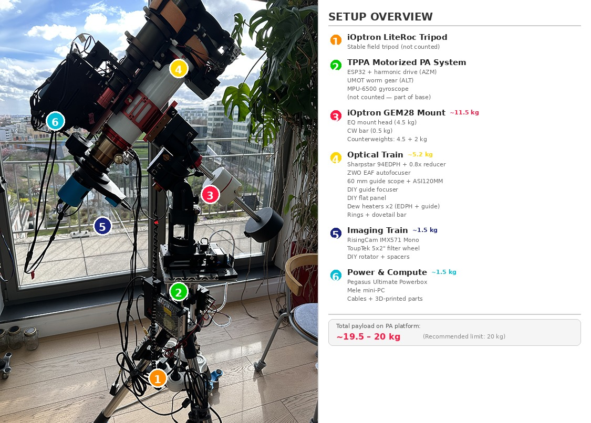

# Serial Alt‑Az Polar Alignment Controller (ESP32 / GRBL / MPU-6500)

Welcome to what is likely **the world's first motorized Polar Alignment mount featuring an active Gyroscopic Machine Learning ratio adaptation.**

This is a minimal **GRBL‑style** firmware + hardware recipe designed to drive a two‑axis (Azimuth & Altitude) mount during polar‑alignment routines such as **TPPA** in **N.I.N.A.**

It runs on the *FYSETC E4 V1.0* (ESP32 + dual TMC2209) and emulates the "Avalon" protocol using a **non‑blocking motion engine**.

> **TL;DR** – Flash the sketch, wire the motors and the MPU-6500 gyroscope, set N.I.N.A. to talk to an **"Avalon Polar Alignment"**, **leave the TPPA "Gear Ratio" field at `1.0`**, and let TPPA's plate-solve loop converge to sub-arcminute precision while the firmware silently learns your mechanics.

> 🏆 **Field-tested result: < 0.2 arcminute polar alignment error** achieved with TPPA in under 4 iterations, with a 20 kg payload.

---

## 🔀 Which Version Should I Build?

Two hardware configurations are supported. The firmware is identical in logic — only the hardware constants change.

| | **Prototype** | **V2** *(in development)* |
|---|---|---|
| ALT axis | Commercial tilt plate + T8 lead screw | Custom CNC ALT V3 (bielle mechanism) |
| AZM bearing | igus PRT-02 LC J4 slewing ring | RU42 crossed roller bearing |
| Base | Monolithic 15180 aluminium profiles | Two-piece CNC aluminium plates |
| Firmware file | `PolarAlign_Prototype.ino` | `PolarAlign_V2.ino` |
| `ALT_MOTOR_GEARBOX` | 148.8 (30:1 × 4.96) | 208.3 (30:1 × 6.94) |
| Status | ✅ **Field-validated — recommended** | 🔧 Under fabrication |
| Hardware docs | [`HARDWARE_Prototype.md`](./HARDWARE_Prototype.md) | [`HARDWARE_V2.md`](./HARDWARE_V2.md) |

> 💡 If you're building for the first time, **start with the Prototype**. It uses off-the-shelf parts, has been validated to < 0.2 arcmin under 20 kg, and the firmware is identical.

---

## 🎬 See It In Action

> 📌 Videos 1–3 show the **Prototype hardware**. Video 4 is a V2 kinematic simulation.

| # | Video | What you'll see |
|---|-------|-----------------|
| 1 | [First Test with Full Payload](https://youtu.be/girvoCZ_UCE) | 15 kg equatorial mount on the PA platform — first motorized movements under real load. |
| 2 | [Homing Sequence (Arduino Serial Monitor)](https://youtu.be/NkoLJ03FSSY) | Live serial output: homing, limit switch detection, pull-off, MPU-6500 gyroscope tare (with the same 15 kg payload). |
| 3 | [**TPPA Session — Below 0.2 Arcminute!**](https://youtu.be/gfE6sZmrzuw) | Complete polar alignment run in N.I.N.A. — watch TPPA converge to < 0.2' in real-time (with the same 15 kg payload). |
| 4 | [**V2 ALT Bielle — Fusion 360 Kinematic Simulation**](https://youtu.be/YnkVJ2hzqB0) | Kinematic simulation of the V2 CNC bielle mechanism: full −2° to +10° travel range, pivot geometry, T8 drive. *(V2 hardware — not yet fabricated)* |

---

## 🔭 Author's Testing Setup

The annotated photo below shows the full astrophotography rig used to develop and validate this project. The PA platform (item 2) carries everything above it — roughly **20 kg of total payload**, which sits right at the recommended limit.



| # | Component | Est. Weight | Details |
|---|-----------|:-----------:|---------|
| 1 | **iOptron LiteRoc Tripod** | — | Stable field tripod (below the PA platform — not counted in payload) |
| 2 | **TPPA Motorized PA System** | — | ESP32 + harmonic drive (AZM), UMOT worm gear (ALT), MPU-6500 gyroscope (part of the base — not counted) |
| 3 | **iOptron GEM28 Mount** | ~11.5 kg | EQ mount head (4.5 kg), CW bar (0.5 kg), counterweights (4.5 + 2 kg) |
| 4 | **Optical Train** | ~5.2 kg | Sharpstar 94EDPH + 0.8× reducer, ZWO EAF autofocuser, 60 mm guide scope + ASI120MM + DIY guide focuser, DIY flat panel, dew heaters ×2, rings + dovetail bar |
| 5 | **Imaging Train** | ~1.5 kg | RisingCam IMX571 Mono, ToupTek 5×2" filter wheel, DIY rotator + spacers |
| 6 | **Power & Compute** | ~1.5 kg | Pegasus Ultimate Powerbox, Mele mini-PC, cables + 3D-printed parts |
| | **Total on PA platform** | **~19.5–20 kg** | Within the recommended 20 kg limit |

> 💡 This is a real-world astrophotography rig, not a test bench. Every firmware version is validated under these conditions.

---

## 🖼️ Build Gallery

The **[IMAGES](./IMAGES/)** directory contains everything you need to visualize the project:

- **`3D_Model/`** — Full CAD renders of the assembly (exploded views, cross-sections, detail shots).
- **`Real_World/`** — Photos from the actual build of the first prototype — wiring, mechanical assembly, field setup.

> 💡 If you're considering building one, start with the 3D renders to understand the architecture, then check the real-world photos to see what it actually looks like assembled.

---

## 🖥️ Desktop Controller GUI

A cross-platform desktop application is included to control the mount **without N.I.N.A.** — useful for bench testing, manual positioning, and firmware configuration.


**Features:**
- **Jog buttons** (±0.1° ±1° ±5°) for both AZM and ALT axes, plus free-field absolute positioning
- **Live position display** with real-time polling (AZM/ALT in degrees and arcminutes)
- **Learning Monitor** — live display of the MPU-measured ALT error and both learned ratios (ALT/AZM), updated automatically after each jog
- **System commands** — HOME, DIAG, RST, AZM:ZERO — one click
- **Raw serial console** — full log + send any command directly
- **Firmware Config tab** — edit all hardware constants (UMOT ratio, crank ratio, currents, limits…) and generate a ready-to-paste Arduino code block
- **Save/Load** configurations as JSON files

**Quick start (Windows):**
1. Download `PolarAlignController.exe` from the [latest Release](../../releases/latest)
2. Double-click — no installation, no Python needed

**From source (any OS):**
```bash
pip3 install pyserial
python3 GUI/PolarAlignGUI.py
```

> 💡 The GUI uses direct serial commands (`ALT:`, `AZM:`) in degrees — these work **without homing**, ideal for bench testing. TPPA uses its own `$J=` protocol in arcminutes during alignment sessions.

> 💡 **DTR/RTS are disabled** on connect to prevent the ESP32 from rebooting when the GUI opens the serial port.

---

## 🌟 Key Features

| Feature | Description |
|---------|-------------|
| 🧠 **ALT Machine Learning** | The MPU-6500 measures real physical movement after every ALT jog, computes the true steps-per-degree ratio, and saves it to EEPROM. The mount silently improves its own accuracy over time. |
| 🧠 **AZM Ratio Learning** | The firmware infers the AZM gear ratio from consecutive TPPA correction residuals (no sensor needed). A triple guard prevents the NaN/deadlock bug present in earlier versions. |
| 🔭 **TPPA-Driven Convergence** | The firmware trusts TPPA's plate-solve loop rather than running its own corrections. Star-based measurements are far more accurate than accelerometer readings. Result: **< 0.2 arcminute**. |
| 📐 **Arcminute Protocol** | Bidirectional unit conversion: TPPA jog commands (arcminutes) → internal degrees → MPos reports back in arcminutes. Direct serial commands remain in degrees for bench testing. |
| 🛡️ **Homing Guard + DTR Persistence** | TPPA jogs are blocked until homing is completed. Homing state (MPU offset + magic word) is saved to EEPROM and **survives DTR-triggered reboots** (GUI ↔ TPPA switch without re-homing). |
| 🔇 **Global Settle** | 2-second anti-vibration delay after every movement before reporting `<Idle>`. Prevents TPPA from plate-solving on a still-vibrating mount. |
| ⚡ **Zero Lag Engine** | Non-blocking trapezoidal acceleration with real-time serial polling. No `delay()` calls in the main loop — N.I.N.A. polls status 10× per second and the firmware never misses a beat. |

---

## 🔬 How It Works: Architecture Deep Dive

### The Challenge

The ALT axis (worm gearbox + lead screw + crank mechanism) is inherently subject to mechanical backlash and hysteresis, especially under a 20 kg payload. The AZM axis (harmonic drive) has its own issue: elastic deformation in the flex spline creates a "lost motion" dead zone on direction reversals. For TPPA to converge reliably, the firmware must handle both problems transparently.

### The Solution: A Three-Layer Architecture

**Layer 1 — Non-Blocking Motion Engine**

The entire firmware is built as a state machine inside `tickMotion()`. Motor pulses, MPU sampling, settle timers, and serial communication are all interleaved without ever calling `delay()`. This is critical because N.I.N.A. polls the status (`?`) ten times per second — a single blocking call would cause buffer overflows, display lag, or connection drops.

The motion engine generates trapezoidal acceleration profiles (soft start → cruise → soft stop) to prevent step loss on high-inertia loads like the 100:1 harmonic drive.

**Layer 2 — MPU-6500 Observe & Learn (Altitude)**

After every ALT movement, the firmware enters a non-blocking observation phase:

1. **Settle** (500 ms) — mechanical vibrations damp out.
2. **Sample** (50 readings over ~250 ms) — the MPU-6500's accelerometer measures the true tilt angle using Earth's gravity vector. Averaging 50 samples eliminates MEMS sensor noise.
3. **Learn** — the firmware compares commanded vs. actual movement, computes a new steps-per-degree ratio, and blends it into the running average (10% EWMA smoothing per observation). If the ratio drifts significantly, it's saved to EEPROM.

The MPU operates in **observe-only mode**: it learns, but never corrects. Earlier firmware versions (v14.67b and before) ran an active correction loop with up to 5 micro-corrections per jog — this added 1–4 seconds of overhead and created complex interactions with TPPA's own convergence loop. Removing the corrections and letting TPPA handle convergence via plate-solving proved both faster and more accurate.

Learning is skipped on direction reversals (backlash would corrupt the measurement). Over a typical TPPA session (6–8 ALT jogs), the ratio converges within 2–3 observations.

**Layer 2b — Residual Learning (Azimuth)**

The AZM axis has no sensor. Instead, the firmware infers the true gear ratio from TPPA's own correction behaviour: if TPPA commanded `prevDelta` arcminutes but still sends a residual correction `currDelta`, the actual movement was `effectiveMoved = prevDelta − currDelta`. From this:

```
measuredRatio = currentRatio × prevDelta / effectiveMoved
```

Three guards prevent the deadlock seen in earlier versions:
1. `effectiveMoved ≥ 0.5'` before division (prevents NaN)
2. `!isnan && !isinf && in-band` before writing (prevents deadlock)
3. State wipe on direction reversal and tiny moves (prevents stale data)

EWMA smoothing is 5% (more conservative than ALT's 10%), and the band is ±10% around theoretical.

**Layer 3 — GRBL Protocol Synchronization**

Taming N.I.N.A.'s strict GRBL parser required several tricks:

- **Silent boot**: The ESP32 emits an unavoidable boot message on USB connect. Stefan Berg patched the TPPA plugin to discard pre-`?` lines — the firmware stays completely silent until asked.
- **Status report scaling**: During MPU observation phases, the reported ALT position is held slightly below target (scaled to ~90% of actual progress). This prevents TPPA from reclaiming control prematurely.
- **Diagnostic buffer**: All MPU data and learning events are written silently to a 4 KB RAM buffer (`diagLog`). N.I.N.A. never sees debug text. The user retrieves the full log via `DIAG`.
- **AZM backlash compensation**: On direction reversals, extra "dead" steps eat through the harmonic drive's elastic deformation zone without updating the reported position.

---

## ⚠️ Before You Start: Homing is Required

**You MUST run `HOME` (or `$H`, or press the physical Home button) before launching a TPPA session.**

Without homing, the firmware doesn't know the true physical position of the ALT axis. The position counter starts at 0.0° regardless of where the tilt plate actually is, causing the software travel limits to clamp movements incorrectly. TPPA will loop endlessly trying to correct an error it can never reach.

The firmware enforces this: **all TPPA jog commands (`$J=`) are silently ignored until homing is completed.** The controller still replies `ok` (so TPPA doesn't hang), but no movement occurs. Check the serial log for `!BLOCKED: ... (HOME not done)`.

**What homing does:**
1. Moves ALT down until the physical limit switch triggers
2. Performs a safety pull-off (0.2°)
3. Defines this position as 0.0° (mechanical zero)
4. Tares the MPU-6500 gyroscope (defines the gravity reference)
5. Saves the homing state (MPU offset + magic word) to EEPROM
6. Unlocks TPPA jog commands

> 💡 **Auto-recovery:** If the limit switch is already pressed at power-on, the firmware runs homing automatically.

> 💡 **DTR Persistence:** Homing state survives a DTR-triggered reboot (e.g., switching from the GUI to TPPA). The firmware restores the MPU offset from EEPROM and reconstructs the ALT position from the sensor — no re-homing needed.

> 💡 **Bench testing without homing:** Direct serial commands (`ALT:`, `AZM:`) and the GUI work without homing. Only TPPA's `$J=` commands are blocked.

---

## ⚡ Electronics & Wiring

Instead of a complex Arduino + shield + external driver assembly, the project leverages a **3D printer control board** repurposed for telescope work.

### The Brain: FYSETC E4 V1.0

| Spec | Value |
|------|-------|
| MCU | ESP32-WROOM-32 @ 240 MHz (dual-core, WiFi/BT) |
| Drivers | 4× TMC2209, factory-soldered, UART-addressed |
| Used channels | MOT-X (Azimuth) + MOT-Y (Altitude) |
| Power input | 12 V DC (24 V supported but 12 V is quieter) |

> ⚠️ **FYSETC E4 V1.0 only!** The V2.0 has a different pin mapping and is **not compatible** without firmware changes.

### The Sensor: MPU-6500 (I2C) & The SD Card Hack

The gyroscope/accelerometer acts as a **digital plumb bob** for the Altitude axis. It measures the tilt plate's absolute angle using Earth's gravity vector — no external reference needed.

> **How we connected it (The Hack):** The FYSETC E4 V1.0 board is a 3D printer controller and does not have a dedicated, easily accessible I2C expansion header. To connect the MPU-6500 cleanly, we **hijacked the onboard microSD card reader**. By entirely bypassing the SD card feature (our firmware uses the ESP32's internal EEPROM and RAM for data storage instead), we repurposed its SPI pins to act as our I2C bus:
> - **GPIO 18** (originally the SD Card `SCK` clock pin) becomes the I2C `SCL` line.
> - **GPIO 19** (originally the SD Card `MISO` data pin) becomes the I2C `SDA` line.

| Wire Color | Signal | ESP32 GPIO | FYSETC E4 Target |
|:----------:|--------|:----------:|------------------|
| 🔴 Red     | VCC (3.3 V) | —        | 3.3V Header      |
| 🟡 Yellow  | GND    | —          | GND Header       |
| 🔵 Blue    | SCL (I2C) | GPIO 18 | SD Card `SCK` pin  |
| 🟢 Green   | SDA (I2C) | GPIO 19 | SD Card `MISO` pin |

> ⚠️ **EMI warning:** Keep the I2C wires (blue/green) as far as possible from stepper motor cables. Twist the GND wire around the I2C lines to act as a shield. The firmware detects I2C failures and reports them via `DIAG`.

### Motors: NEMA 17 + TMC2209

| Axis | E4 Port | STEP | DIR | Mode | Microstepping | Current | Rationale |
|------|---------|:----:|:---:|------|:-------------:|:-------:|-----------|
| **AZM** | MOT-X | GPIO 27 | GPIO 26 | SpreadCycle | 16 | 600 mA | Firmer hold on non-self-locking harmonic drive |
| **ALT** | MOT-Y | GPIO 33 | GPIO 32 | SpreadCycle | 4 | 300 mA | Maximum torque for lifting payload through worm gear |

> The AZM axis uses **SpreadCycle** (not StealthChop) because the harmonic drive is not self-locking — SpreadCycle provides a firmer, more predictable static hold under load. The ALT current is deliberately low (300 mA) to prevent overheating inside the compact UMOT worm gearbox housing. See [Motor Thermal Management](#-motor-thermal-management) for details.

### Safety Inputs

| Function | E4 Silk | GPIO | Type | Purpose |
|----------|---------|:----:|------|---------|
| **Limit Switch** | Z-MIN | 34 | Input only | Physical endstop at ALT bottom-of-travel. Triggers emergency stop + pull-off if hit outside homing. |
| **Home Button** | Y-MIN | 35 | Input only | Manual push-button to trigger full homing + gyroscope tare sequence. |

### UART Jumpers (Critical!)

The TMC2209 drivers communicate with the ESP32 via a shared UART bus. **You must place two jumper caps** on the TXD/RXD header to enable this communication. Without them, the motors won't respond. See the [FYSETC E4 Wiki](https://wiki.fysetc.com/docs/E4) for jumper placement details.

### Full GPIO Map

| Signal | Axis / Role | ESP32 GPIO | E4 silkscreen |
|--------|-------------|:----------:|---------------|
| STEP | AZM | 27 | MOT‑X |
| DIR | AZM | 26 | MOT‑X |
| EN | Both | 25 | /ENABLE (Active LOW) |
| UART | AZM & ALT | 21 | Shared Bus (Addr 1 = AZM, Addr 2 = ALT) |
| STEP | ALT | 33 | MOT‑Y |
| DIR | ALT | 32 | MOT‑Y |
| SCL | Gyroscope | 18 | SD Card `SCK` |
| SDA | Gyroscope | 19 | SD Card `MISO` |
| SENSOR | ALT Limit | 34 | Z-MIN |
| BUTTON | Manual Home | 35 | Y-MIN |

---

## ⚖️ Payload Rating

This mount is designed for **heavy-duty astrophotography setups**. The operating range for the ALT axis is intentionally small (0–10°): the equatorial mount should be set to roughly your site latitude minus 1–2°, so the PA mount only needs fine corrections.

| Rating | Max Payload | Notes |
|--------|-------------|-------|
| **Recommended** | **20 kg** | Safe for all builders, ~2× margin. The author's own [testing setup](#-authors-testing-setup) sits right at this limit. |
| **Advanced** | **25 kg** | Requires centered payload and careful assembly. |

**Weakest link analysis — Prototype (igus PRT-02 LC):**

The limiting factor is the **igus PRT-02 LC J4 orientation ring** (azimuth bearing). Its tilting moment capacity (eccentric off-axis load) is not published for the LC variant — this is why we cap the recommended payload at 20 kg with a safety margin.

| Component | Capacity | Actual Load | Margin |
|-----------|----------|-------------|--------|
| igus PRT-02 – Axial dynamic | 4,000 N (~408 kg) | ~245 N | 16× |
| igus PRT-02 – Radial dynamic | 500 N (~51 kg) | ~50 N | 10× |
| igus PRT-02 – Tilting moment | Unknown (LC variant) | ~25–37 Nm est. | ⚠️ **Assumed weakest** |
| T8×2mm lead screw | 500–1000 N | ~25–40 N | 15–25× |
| UMOT worm gearbox | ≥2 Nm output | ~0.25 Nm required | 8–16× |
| 15180 aluminum profiles | >5 kN bending | <250 N | 20×+ |

> **V2 note:** The RU42 crossed roller bearing (OD=70mm) used in V2 has fully published load ratings, eliminating the tilting-moment uncertainty of the igus LC variant. See [`HARDWARE_V2.md`](./HARDWARE_V2.md) for the full V2 payload analysis.

> **Builder's note:** All 3D-printed parts (motor cradles, sensor brackets, enclosures) are **non-structural** and carry only the weight of their respective components. The telescope payload is transmitted entirely through metal: tilt plate → lead screw → chassis → bearing → tripod.

---

## 🔧 ALT Motor: Speed vs Torque (UMOT Ratio)

The ALT axis uses a NEMA 17 + UMOT worm gearbox driving a T8×2mm lead screw through a crank-arm mechanism. The total gear ratio is `UMOT ratio × crank factor`.

- **Prototype:** crank factor ≈ 4.96 → `ALT_MOTOR_GEARBOX = 148.8`
- **V2 (ALT V3 CNC):** crank factor ≈ 6.94 (longer arm, deeper travel) → `ALT_MOTOR_GEARBOX = 208.3`

| UMOT Ratio | Total Ratio | Time for 1° | Torque Margin | Self-Locking | Status |
|:----------:|:-----------:|:-----------:|:-------------:|:------------:|--------|
| **100:1** | ~496:1 | 6.3 s | 80× | ✅ Worm + screw | Previous prototype |
| **50:1** | ~248:1 | 3.1 s | 40× | ✅ Worm + screw | Conservative, 2× faster |
| **30:1** | ~149:1 | 1.9 s | 23× | ⚠️ Screw only | **Current prototype — field tested** |
| **17:1** | ~84:1 | 1.1 s | 13× | ❌ Screw only | Fast but risky in cold weather |

> **Safety note:** The T8×2mm lead screw is always self-locking (helix angle 4° < friction angle ~8.5°). The telescope cannot back-drive under any circumstance, even if the worm gear loses self-locking at lower ratios.

**Firmware change when switching ratio:** Edit `ALT_MOTOR_GEARBOX` directly, or use the GUI Config tab (which exposes `UMOT_RATIO` and `TILT_CRANK_RATIO` as separate fields and auto-computes the product). After changing, the old EEPROM learned ratio is automatically detected as out-of-band and discarded at boot — the firmware recalibrates within 2–3 movements via MPU learning.

---

## 🌡️ Motor Thermal Management

The ALT stepper receives holding current even when stationary. Inside the compact UMOT housing:

| RMS Current | Power | Temperature | PLA-safe? |
|:-----------:|:-----:|:-----------:|:---------:|
| 800 mA (old) | ~1.6 W | 55–65°C | ❌ |
| **300 mA (default)** | ~0.2 W | Barely warm | ✅ |
| 400 mA (cold weather) | ~0.4 W | ~35°C | ✅ |

> Use **PETG** or **ABS** for the ALT motor cradle if running above 300 mA. At 300 mA, standard PLA is fine.

---

## ⚙️ Arduino IDE Setup

1. **Install ESP32 core** — Boards Manager → *esp32* (≥ v2.0.17)
   ```
   Preferences → Additional Board URLs:
   https://raw.githubusercontent.com/espressif/arduino-esp32/gh-pages/package_esp32_index.json
   ```

2. **Install TMCStepper library** via Library Manager

3. **Board settings:**

   | Option | Value |
   |--------|-------|
   | Board | ESP32 Dev Module |
   | CPU Freq | 240 MHz |
   | Flash Size | 4 MB |
   | Partition | Huge APP (3 MB / 1 MB SPIFFS) |
   | Upload speed | 115200 bps |

4. **Choose your sketch** from the `Arduino code/` directory:

   | Your hardware | Sketch to flash |
   |---|---|
   | Commercial tilt plate + igus bearing | `PolarAlign_Prototype.ino` |
   | ALT V3 CNC + RU42 bearing | `PolarAlign_V2.ino` |

> On boot, the serial monitor is silent for ~1 second (Silent Boot). Send `?` to wake it up.

---

## 🛠️ Configuration Knobs

Edit in the Arduino sketch or use the **Firmware Config tab** in the GUI (generates copy-pasteable code). The GUI splits `ALT_MOTOR_GEARBOX` into `UMOT_RATIO` × `TILT_CRANK_RATIO` for clarity.

The only constants that differ between hardware versions are highlighted:

```cpp
/* ───── HARDWARE SETTINGS ───── */
constexpr float MOTOR_FULL_STEPS = 200.0f;    // 1.8° motor = 200 full steps/rev
constexpr uint16_t MICROSTEPPING_AZM = 16;    // SpreadCycle — firm hold on harmonic drive
constexpr uint16_t MICROSTEPPING_ALT = 4;     // SpreadCycle — maximum torque
constexpr float GEAR_RATIO_AZM = 100.0f;      // Harmonic drive ratio (both versions)

// ⚠️ VERSION-DEPENDENT — see table below
constexpr float ALT_MOTOR_GEARBOX = 148.8f;   // Prototype: UMOT 30:1 × 4.96 crank
// constexpr float ALT_MOTOR_GEARBOX = 208.3f; // V2:        UMOT 30:1 × 6.94 crank (V3 bielle)

constexpr float ALT_SCREW_PITCH_MM = 2.0f;    // T8 lead screw: 2 mm per revolution
constexpr float ALT_RADIUS_MM = 60.0f;        // Distance pivot → lead screw attachment

constexpr bool AXIS_REV_AZM = true;           // Flip if your mount moves backwards
constexpr bool AXIS_REV_ALT = true;

constexpr uint16_t RMS_CURRENT_AZM = 600;     // mA — harmonic drive
constexpr uint16_t RMS_CURRENT_ALT = 300;     // mA — thermal-safe inside UMOT housing

/* ───── TRAVEL LIMITS (degrees) ───── */
constexpr float AZM_LIMIT_NEG = -30.0f;
constexpr float AZM_LIMIT_POS =  30.0f;
constexpr float ALT_LIMIT_NEG =   0.0f;
constexpr float ALT_LIMIT_POS =  10.0f;

/* ───── ALT MPU LEARNING ───── */
constexpr float MIN_LEARNING_ANGLE = 0.5f;        // Min move for ML ratio update (deg)
constexpr float LEARNING_SMOOTHING = 0.10f;       // EWMA weight — 10% new, 90% history
constexpr unsigned long GLOBAL_SETTLE_MS = 2000;  // Anti-vibration delay before Idle (ms)

/* ───── AZM RATIO LEARNING ───── */
constexpr float AZM_LEARNING_SMOOTHING = 0.05f;   // EWMA weight — 5% (conservative)
constexpr float AZM_RATIO_BAND_LOW  = 0.90f;      // Reject ratio updates outside ±10%
constexpr float AZM_RATIO_BAND_HIGH = 1.10f;
```

**Version-dependent constants at a glance:**

| Constant | Prototype | V2 |
|---|---|---|
| `ALT_MOTOR_GEARBOX` | `148.8` | `208.3` |
| Firmware file | `PolarAlign_Prototype.ino` | `PolarAlign_V2.ino` |

Everything else is identical. The MPU learning system will adapt to your exact mechanics regardless of starting value.

---

## 🧪 Serial Command Reference

Use the **Arduino IDE Serial Monitor** or the **PolarAlign Controller GUI** (115200 baud, Newline line ending).

### Direct Commands (bench testing, degrees)

| Command | Action |
|---------|--------|
| `HOME` / `$H` | **Homing + Tare** — required before TPPA. Saves state to EEPROM. |
| `DIAG` / `MPU?` | **Full diagnostic** — sensor status, positions, learned ratios (ALT + AZM), command log. |
| `ALT:2.5` | Move ALT to 2.5° (absolute). |
| `AZM:5.0` | Move AZM to 5.0° (absolute, from power-on zero). |
| `AZM:ZERO` | Redefine current AZM position as 0.0° **and reset AZM learning state**. |
| `RST` | Soft reset — abort motion, clear log, reset learning state. |
| `MPU` | Lightweight gyroscope query — returns `MPU:tared,raw` on a single line. |

### GRBL Protocol (used by N.I.N.A / TPPA, arcminutes)

| Command | Meaning |
|---------|---------|
| `$J=G53X+300.00F400` | Absolute jog: AZM to +300' (= 5.0°) |
| `$J=G91G21Y-390.00F300` | Relative jog: ALT –390' (= –6.5°) |
| `?` | Status poll → `<Idle\|MPos:x,y,0\|>` |
| `!` / `~` | Feed-Hold / Resume |

> 💡 MPos values are in **arcminutes**. With TPPA Gear Ratio = `1.0`, they map directly.

> ⚠️ **TPPA Free Field** sends absolute commands (G53) — the value is a target position, not a delta. Preset buttons (±1, ±5) send relative commands (G91). During auto-alignment, everything is relative.

---

## 📄 License

**MIT License** — do whatever you want, just keep the header.

---

## 🙏 Acknowledgements

* **Stefan Berg** – author of the **Three-Point Polar Alignment** plug-in and core N.I.N.A. contributor; his protocol docs and DLL patches made this project possible.
* **Avalon Instruments** – for the idea of a lean, GRBL-style alignment controller.
* **Claude** (Anthropic) & **Gemini** (Google) – for the non-blocking engine architecture, the gyroscopic ML system, the GRBL protocol reverse-engineering, and months of hardcore debugging.
* Maintained by **Antonino Nicoletti** ([antonino.antispam@free.fr]) – *clear skies!*
