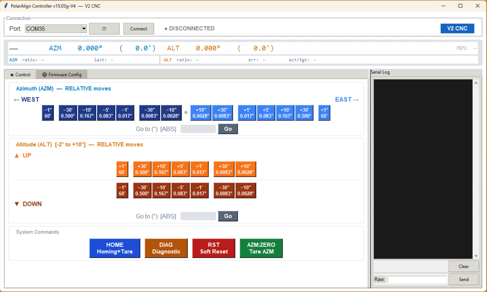

# Serial Alt‑Az Polar Alignment Controller (ESP32 / GRBL / MPU-6500)

Welcome to what is likely **the world's first motorized Polar Alignment mount featuring an active Gyroscopic Machine Learning ratio adaptation.**

This is a minimal **GRBL‑style** firmware + hardware recipe designed to drive a two‑axis (Azimuth & Altitude) mount during polar‑alignment routines such as **TPPA** in **N.I.N.A.**

It runs on the *FYSETC E4 V1.0* (ESP32 + dual TMC2209) and emulates the "Avalon" protocol using a **non‑blocking motion engine**.

> **TL;DR** – Flash the sketch, wire the motors and the MPU-6500 gyroscope, set N.I.N.A. to talk to an **"Avalon Polar Alignment"**, **leave the TPPA "Gear Ratio" field at `1.0`**, and let TPPA's plate-solve loop converge to sub-arcminute precision while the firmware silently learns your mechanics.

> 🏆 **Field-tested result: < 0.2 arcminute polar alignment error** achieved with TPPA in under 4 iterations.

---

## 🎬 See It In Action

| # | Video | What you'll see |
|---|-------|-----------------|
| 1 | [First Test with Full Payload](https://youtu.be/girvoCZ_UCE) | 15 kg equatorial mount on the PA platform — first motorized movements under real load. |
| 2 | [Homing Sequence (Arduino Serial Monitor)](https://youtu.be/NkoLJ03FSSY) | Live serial output: homing, limit switch detection, pull-off, MPU-6500 gyroscope tare (with the same 15Kg payload). |
| 3 | [**TPPA Session — Below 0.2 Arcminute!**](https://youtu.be/gfE6sZmrzuw) | Complete polar alignment run in N.I.N.A. — watch TPPA converge to < 0.2' in real-time (with the same 15Kg payload). |

## 🖼️ Build Gallery

The **[IMAGES](./IMAGES/)** directory contains everything you need to visualize the project:

- **`3D_Model/`** — Full CAD renders of the assembly (exploded views, cross-sections, detail shots).
- **`Real_World/`** — Photos from the actual build of the first prototype — wiring, mechanical assembly, field setup.

> 💡 If you're considering building one, start with the 3D renders to understand the architecture, then check the real-world photos to see what it actually looks like assembled.

---

## 🖥️ Desktop Controller GUI

A cross-platform desktop application is included to control the mount **without N.I.N.A.** — useful for bench testing, manual positioning, and firmware configuration.



**Features:**
- **Jog buttons** (±0.1° ±1° ±5°) for both AZM and ALT axes, plus free-field absolute positioning
- **Live position display** with real-time polling (AZM/ALT in degrees and arcminutes)
- **System commands** — HOME, DIAG, RST, AZM:ZERO — one click
- **Raw serial console** — full log + send any command directly
- **Firmware Config tab** — edit all hardware constants (gear ratios, currents, limits…) and generate a ready-to-paste Arduino code block
- **Save/Load** configurations as JSON files

**Quick start (Windows):**
1. Download `PolarAlignController.exe` from the [latest Release](../../releases/latest)
2. Double-click — no installation, no Python needed

**From source (any OS):**
```bash
pip3 install pyserial
python3 PolarAlignGUI.py
```

> 💡 The GUI communicates using direct serial commands (`ALT:`, `AZM:`) in degrees. These commands work **without homing** — ideal for bench testing. TPPA uses its own `$J=` protocol (in arcminutes) when running an alignment session.

---

## 🌟 Key Features

| Feature | How it works |
|---------|-------------|
| 🧠 **Machine Learning Ratio** | The MPU-6500 gyroscope measures the *real* physical movement of the tilt-plate after every ALT jog and compares it to the theoretical motor steps. The firmware **automatically calculates and saves an optimized gear ratio** to EEPROM — silently improving accuracy over time without slowing down your alignment session. |
| 🔭 **TPPA-Driven Convergence** | The firmware trusts TPPA's plate-solve loop for convergence rather than running its own internal correction cycles. This eliminates 1–4 seconds of overhead per jog that older versions spent on MPU micro-corrections. TPPA's star-based measurements are far more accurate than accelerometer readings, and the result speaks for itself: **< 0.2 arcminute** alignment error. |
| 📐 **Arcminute Protocol** | Full bidirectional unit conversion: incoming TPPA jog commands (in arcminutes) are converted to degrees internally, and outgoing MPos reports are converted back to arcminutes. Direct serial commands (`ALT:`, `AZM:`) remain in degrees for easy bench testing. |
| 🛡️ **Anti-Crash & Auto-Recovery** | **Software endstops** (AZM ±30°, ALT 0–5°) prevent the mount from exceeding safe travel. If the mount is resting on its physical limit switch at power-on, the system **automatically runs a homing/pull-off sequence** to free itself safely. |
| 🔇 **Global Settle** | After every movement, the firmware waits **2 seconds** for mechanical vibrations to damp before reporting `<Idle>`. This prevents TPPA from plate-solving on a still-vibrating mount, ensuring clean astrometric data. |
| ⚡ **Zero Lag Engine** | Strict polling architecture: non-blocking trapezoidal acceleration eliminates step-loss on high inertia loads (Harmonic Drives) while maintaining perfect buffer synchronization (fixes N.I.N.A display lag). |

---

## ⚠️ Before You Start: Homing is Required

**You MUST run `HOME` (or `$H`, or press the physical Home button) before launching a TPPA session.**

Without homing, the firmware does not know the true physical position of the ALT axis. The internal position counter starts at 0.0° regardless of where the tilt plate actually is. This causes the software travel limits (ALT 0–5°) to clamp movements incorrectly, and TPPA will loop endlessly trying to correct an error it can never reach.

The firmware enforces this: **all TPPA jog commands (`$J=`) are silently ignored until homing is completed.** The controller still replies `ok` (so TPPA doesn't hang), but no movement occurs. If you see TPPA running but the mount isn't moving, check the serial log — you'll see `!BLOCKED: ... (HOME not done)`.

**What homing does:**
1. Moves ALT down until the physical limit switch triggers
2. Performs a safety pull-off (0.2°)
3. Defines this position as 0.0° (mechanical zero)
4. Tares the MPU-6500 gyroscope
5. Unlocks TPPA jog commands

> 💡 **Auto-recovery:** If the limit switch is already pressed at power-on (e.g. the mount was stored at its lowest position), the firmware detects this and runs homing automatically — no action needed.

> 💡 **Bench testing without homing:** Direct serial commands (`ALT:`, `AZM:` via the GUI or serial monitor) work without homing. Only TPPA's `$J=` commands are blocked.

---

## ⚖️ Payload Rating

This mount is designed for **heavy-duty astrophotography setups**. The operating range for the ALT axis is intentionally small (0–5°): the equatorial mount sitting on top should be set to roughly your site latitude minus 1–2°, so the PA mount only needs fine corrections.

| Rating | Max Payload | Notes |
|--------|-------------|-------|
| **Recommended** | **20 kg** | Safe for all builders, with a ~2× safety margin on the weakest link. |
| **Advanced** | **25 kg** | Tested by the author. Requires centered payload and careful assembly. |

**Weakest link analysis:**

The limiting factor is **not** the motor or the gearbox — it is the **igus PRT-02 LC J4 orientation ring** (azimuth bearing). Its rated specs are generous for centered axial loads (4,000 N dynamic = ~408 kg), but the **tilting moment capacity** (eccentric load) is the real constraint for telescope setups where the center of gravity sits above and offset from the bearing.

| Component | Capacity | Status |
|-----------|----------|--------|
| igus PRT-02 LC J4 – Axial dynamic | 4,000 N (~408 kg) | ✅ Not limiting |
| igus PRT-02 LC J4 – Radial dynamic | 500 N (~51 kg) | ✅ Not limiting |
| igus PRT-02 LC J4 – Tilting moment | Not published for LC variant | ⚠️ **Weakest link** |
| T8×2mm lead screw (axial load @2° tilt) | ~500–1000 N rated | ✅ ~25–40 N actual |
| UMOT worm gearbox (any ratio) | Torque margin ≥ 7× @25 kg | ✅ Comfortable |
| 15180 aluminum profiles (crossed) | Effectively unlimited | ✅ Overkill |
| 3D-printed parts (motor cradles, sensor brackets, enclosures) | Non-structural (no telescope load) | ✅ Not in load path |

> **Builder's note:** Several parts are 3D-printed (ALT and AZM motor cradles, MPU bracket, homing sensor bracket, FYSETC enclosure, PSU case), but **none are in the telescope load path**. They carry only the weight of their respective components (motors, sensors, electronics). The telescope payload is transmitted entirely through metal: tilt plate → lead screw → crossed 15180 profiles → igus bearing → tripod. The author uses PLA+CF; PETG is recommended for the ALT motor cradle due to proximity to the UMOT housing heat.

---

## 🔩 Hardware Overview

See **[`HARDWARE.md`](./HARDWARE.md)** for full assembly photos, 3D files (including a drilling jig!), and detailed wiring diagrams.

> ⚠️ **IMPORTANT WARNING**
> **Please note that this is still an ongoing open-source project!**

| Part | Notes |
|------|-------|
| **FYSETC E4 V1.0** | ESP32‑WROOM‑32, 4 × on‑board TMC2209 – we use two of them (MOT‑X = Azimuth, MOT‑Y = Altitude) |
| **MPU-6500 Module** | I2C Gyroscope/Accelerometer used for ML ratio learning on the Altitude axis. |
| **Stepper motors** | 1.8 ° NEMA‑17 recommended (e.g. 17HS19‑2004S1) |
| **Supply** | 12 V DC (quiet) — 24 V also works if your mechanics can take it |

### Default GPIO Map (Firmware v14.x)

| Signal   | Axis / Role | ESP32 GPIO | E4 silkscreen | Notes |
|----------|-------------|------------|---------------|-------|
| STEP     | AZM         | 27         | **MOT‑X** | |
| DIR      | AZM         | 26         | **MOT‑X** | |
| EN       | Both        | 25         | `/ENABLE`     | Active LOW |
| UART RX  | AZM & ALT   | 21         | Shared Bus    | **Set Addr 1 (AZM) & Addr 2 (ALT) via jumpers** |
| STEP     | ALT         | 33         | **MOT‑Y** | |
| DIR      | ALT         | 32         | **MOT‑Y** | |
| SCL      | Gyroscope   | 18         | SCL           | I2C Clock (MPU-6500) |
| SDA      | Gyroscope   | 19         | SDA           | I2C Data (MPU-6500) |
| SENSOR   | ALT Limit   | 34         | Z-MIN         | Physical Limit Switch (Input Only) |
| BUTTON   | Manual Home | 35         | Y-MIN         | Manual Home Button (Input Only) |

---

## ⚙️ Arduino IDE Setup

1. **Install ESP32 core**
   ```text
   Preferences → Additional Board URLs:
   [https://raw.githubusercontent.com/espressif/arduino-esp32/gh-pages/package_esp32_index.json](https://raw.githubusercontent.com/espressif/arduino-esp32/gh-pages/package_esp32_index.json)
   ```
   Boards Manager → *esp32* (≥ v2.0.17).
   
2. **Arduino code**
   * Download the last version of the Arduino code in the **Arduino directory**.

3. **Install library**
   * **TMCStepper** (latest version) via Library Manager.

4. **Board menu settings**

   | Option             | Value |
   |--------------------|-------|
   | Board              | **ESP32 Dev Module** |
   | CPU Freq           | 240 MHz (WiFi/BT) |
   | Flash Freq / Mode  | 80 MHz / DIO |
   | Flash Size         | 4 MB |
   | Partition Scheme   | Huge APP (3 MB / 1 MB SPIFFS) |
   | Upload speed       | 115 200 bps |
   | Port               | `COMx` / `/dev/tty.usbmodem…` |

5. **Upload**
   Compile ⇒ Upload.
   > **Note:** On boot, the serial monitor will be completely empty for about 1 second (Silent Boot). Send `?` to wake it up or use the diagnostic commands below.

---

## 🧪 Serial Command Reference

To test your mount, open the **Arduino IDE Serial Monitor** or the **PolarAlign Controller GUI**.
⚠️ **CRITICAL:** Set the baud rate to **`115200`** and the line ending to **`Newline`** (or `Both NL & CR`).

### 1️⃣ Custom Diagnostic & Manual Control (For Makers)

These commands were specifically built to help you test the mechanics and the ML ratio learning without needing N.I.N.A.

| Command      | Action |
|--------------|--------|
| `HOME` (or `$H`) | **Trigger Homing & Tare:** The mount will move down until it hits the limit switch, perform a safety pull-off, define this point as `0.0°`, and perfectly tare the MPU-6500 Gyroscope. **Required before any TPPA session.** |
| `DIAG` (or `MPU?`) | **Print System Diagnostic:** The ultimate debugging tool. It instantly prints the Limit Switch status, the Raw Gyroscope reading, the Tared physical angle, any I2C EMI errors, the current ML-learned Gear Ratio from EEPROM, and the full command log. |
| `ALT:2.5`    | **Absolute Altitude Jog (degrees):** Commands the mount to go to an absolute altitude of `2.5°`. Watch the Serial Monitor to see the ML ratio learning in action as the MPU observes the actual movement. |
| `AZM:5.0`    | **Absolute Azimuth Jog (degrees):** Commands the mount to go to an absolute azimuth angle of `5.0°`. Note: **0.0°** is defined as the position of the mount at power-on. |
| `AZM:ZERO`   | **Tare Azimuth:** Instantly defines the current physical position of the mount as the new absolute `0.0°` for the Azimuth axis without needing to reboot the controller. |
| `RST`        | **Soft Reset:** Instantly aborts any motion, clears the diagnostic log, and resets the state machine. |

> 💡 **Unit note:** Direct serial commands (`ALT:`, `AZM:`) use **degrees** for intuitive bench testing. TPPA commands (`$J=`) use **arcminutes** — the firmware handles the conversion automatically.

### 2️⃣ GRBL‑Style (Used by N.I.N.A / TPPA)

This is the hidden language your mount uses to talk to astrophotography software. All values are in **arcminutes**.

| Command                  | Meaning | Response |
|--------------------------|---------|----------|
| `$J=G53X+300.00F400`     | Absolute jog to **+300 arcmin** (= 5.0°) on **Azimuth** | `ok` |
| `$J=G91G21Y-390.00F300`  | Relative jog **–390 arcmin** (= –6.5°) on **Altitude** | `ok` |
| `?`                      | Poll Status (used 10 times a second by N.I.N.A) | `<Idle\|MPos:…\|>` + `\n` |
| `!` / `~`                | Feed‑Hold / Cycle-Resume | `ok` |

> 💡 **MPos Reporting:** Status responses report positions in **arcminutes** (e.g. `MPos:300.000,150.000,0`). With the recommended TPPA Gear Ratio of `1.0`, these values map directly to arcminutes of movement.

> ⚠️ **TPPA Free Field Warning:** In the TPPA interface, the **preset buttons** (e.g. +1, -1, +5, -5) send **relative** commands (G91) — they move the mount *by* that many arcminutes. However, the **free text field** sends **absolute** commands (G53) — the value you type is a *target position* in arcminutes, not a delta. This only affects manual testing — during an actual TPPA alignment session, all corrections are sent automatically via relative commands.

---

## 🧠 How the MPU-6500 Machine Learning Works

The MPU-6500 gyroscope operates in **observe-only mode**: it watches but never interferes with TPPA's convergence.

**After every ALT movement:**

1. **Settle** (500 ms) — wait for mechanical vibrations to damp.
2. **Observe** (50 samples over ~250 ms) — measure the actual physical angle.
3. **Learn** — compare the commanded movement to the measured movement, compute a new steps-per-degree ratio, and blend it into the running average using exponential smoothing (10% weight per observation).
4. **Save** — if the ratio drifts significantly from the stored value, write it to EEPROM.

**Total overhead: ~750 ms per ALT jog** (versus 1–4 seconds in earlier firmware versions that ran correction loops).

The learning only occurs on same-direction moves. When the ALT axis reverses direction, the firmware skips learning for that move because backlash would corrupt the measurement. Over a typical TPPA session (6–8 ALT jogs), the ratio converges within 2–3 observations.

**Why not correct with the MPU?** TPPA's plate-solve loop is astronomically more accurate (literal star positions vs. a ±0.05° accelerometer). The MPU's job is to make each individual jog more accurate by learning the true mechanical ratio — so TPPA needs fewer iterations to converge.

---

## 🔧 ALT Motor: Speed vs Torque (Choosing Your UMOT Ratio)

The ALT axis uses a NEMA 17 stepper coupled to a **UMOT worm gearbox**, which drives a T8×2mm lead screw through a crank-arm mechanism. The total gear ratio is approximately `UMOT ratio × 5` (the crank adds ~5× reduction).

Since this mount operates in a narrow 0–5° range (fine polar alignment corrections), the torque requirements are very low. This means you can trade some of the massive torque margin for **speed** by choosing a lower UMOT ratio.

### Comparison Table (for 25 kg payload at 0–5° tilt)

| UMOT Ratio | Total Effective | Time for 1° | Torque Margin | Self-Locking (worm) | Recommendation |
|------------|----------------|-------------|---------------|---------------------|----------------|
| **100:1** | ~496:1 | 6.3 s | 80× | ✅ Yes | Current prototype — safe but very slow |
| **50:1** | ~248:1 | 3.1 s | 40× | ✅ Yes | Conservative, 2× faster |
| **30:1** | ~149:1 | 1.9 s | 23× | ⚠️ Borderline | **Best balance** — 3.3× faster *(on order)* |
| **17:1** | ~84:1 | 1.1 s | 13× | ❌ Lost | Fast but risky in cold weather |

> **Safety note:** Even if the worm gearbox loses its self-locking property at lower ratios (30:1 and below), the **T8×2mm lead screw is always self-locking** (helix angle 4° < friction angle ~8.5°). The telescope cannot back-drive through this screw under any circumstance. The axial load on the screw at 2° tilt with 25 kg is only ~25–40 N, well within the bronze nut's rated capacity of 500–1000 N.

### Author's choice: 30:1 *(pending field validation)*

The 30:1 ratio should deliver 1.9 seconds per degree (a typical 2° adjustment would complete in under 4 seconds instead of 12.6 seconds with the current 100:1), while maintaining a comfortable 23× torque margin even in the worst case. For a TPPA session requiring 6–8 altitude corrections, this would save 1–2 minutes of waiting per alignment run.

> ⚠️ **Status:** The UMOT 30:1 has been ordered but **not yet received or tested**. The current prototype uses the 100:1 ratio, which works perfectly but is slow on large movements. This section will be updated with real-world results once the 30:1 is installed and field-tested.

### Firmware changes when switching ratio

Only one constant needs to change:
```cpp
constexpr float ALT_MOTOR_GEARBOX = 30.0f;   // was 496.0f for the 100:1 + crank
```

After changing the ratio, **erase the EEPROM** (the machine-learned value from the old ratio is invalid). The firmware will automatically recalibrate within 2–3 ALT movements using MPU feedback.

---

## 🌡️ Motor Thermal Management

The ALT stepper motor receives a constant holding current even when stationary. With the default 800 mA RMS setting, this dissipates ~1.6 W inside the compact UMOT housing, reaching surface temperatures of **55–65°C** — hot to the touch but within the motor's 130°C insulation rating.

Since the torque margin is enormous (23× at 30:1, 80× at 100:1), the firmware ships with a **reduced ALT current of 300 mA**, dropping dissipation to ~0.2 W. The motor will be barely warm.

```cpp
constexpr uint16_t RMS_CURRENT_ALT = 300;   // Thermal-optimized (was 800)
```

> **For cold-weather observers:** If you operate below -10°C with thick grease, you can raise this to 400 mA for extra starting torque. Even at 400 mA, the motor stays well below 40°C.
>
> ⚠️ **Material note:** The author uses PLA+CF (carbon fiber reinforced) for all printed parts. For the **ALT motor cradle** specifically (in contact with the UMOT housing), PETG (75°C) or ABS (95°C) is recommended if you plan to run `RMS_CURRENT_ALT` above 300 mA. At the default 300 mA, PLA+CF or standard PLA is fine.

---

## 🛠️ Configuration Knobs

Open **the last version of the Arduino code** (or use the **Firmware Config tab** in the GUI) to adjust the physical properties of your specific build. Since every DIY mount is different, you might need to tweak these values before compiling:

```cpp
/* ───── HARDWARE SETTINGS (Immutable physical properties) ───── */
constexpr float MOTOR_FULL_STEPS = 200.0f; // Standard 1.8° NEMA 17
constexpr uint16_t MICROSTEPPING_AZM = 16; // StealthChop for smooth Azimuth
constexpr uint16_t MICROSTEPPING_ALT = 4;  // SpreadCycle for high torque on Altitude

// Gear Ratios (Theoretical starting points)
// Note: The firmware will dynamically adjust the ALT ratio via MPU learning and save it to EEPROM.
constexpr float GEAR_RATIO_AZM = 100.0f;     // Harmonic drive ratio
constexpr float ALT_MOTOR_GEARBOX = 496.0f;  // UMOT 100:1 + crank ~5×. Change to 30.0 for UMOT 30:1.
constexpr float ALT_SCREW_PITCH_MM = 2.0f;   // Lead screw pitch (T8 = 2mm per revolution)
constexpr float ALT_RADIUS_MM = 60.0f;       // Distance from pivot axis to the lead screw

// Axis Directions
// -> Change to 'false' if your mount moves in the wrong direction!
constexpr bool AXIS_REV_AZM = true;        
constexpr bool AXIS_REV_ALT = true;        

// Motor Currents (in mA)
// -> ALT is set low (300mA) to prevent overheating inside the UMOT housing.
//    Increase to 400mA only if you experience stalling in extreme cold.
//    AZM can stay at 600mA (Harmonic Drive has good ventilation).
constexpr uint16_t RMS_CURRENT_AZM = 600;  
constexpr uint16_t RMS_CURRENT_ALT = 300;  

/* ───── TRAVEL LIMITS (in degrees) ───── */
constexpr float AZM_LIMIT_NEG = -30.0f;   // ±30° azimuth travel
constexpr float AZM_LIMIT_POS =  30.0f;
constexpr float ALT_LIMIT_NEG =   0.0f;   // 0–5° altitude travel
constexpr float ALT_LIMIT_POS =   5.0f;

/* ───── MPU LEARNING THRESHOLDS (For advanced users) ───── */
constexpr float ALT_TOLERANCE_DEG = 0.05f;     // Minimum move to trigger MPU observation
constexpr float MIN_LEARNING_ANGLE = 0.5f;     // Minimum move for ML ratio update
constexpr float LEARNING_SMOOTHING = 0.10f;    // EWMA weight (10% new, 90% history)
constexpr unsigned long GLOBAL_SETTLE_MS = 2000; // Anti-vibration delay before Idle (ms)
```
---

## 📄 License

**MIT License** — do whatever you want, just keep the header.

---

## 🙏 Acknowledgements

* **Stefan Berg** – author of the **Three-Point Polar Alignment** plug-in and core N.I.N.A. contributor; his support was key to cracking the handshake protocol.
* **Avalon Instruments** – for the idea of a lean, GRBL-style alignment controller.
* **Claude** & **Gemini** (AI) – for the non-blocking engine architecture, the gyroscopic ML system, and the hardcore debugging.
* Maintained by **Antonino Nicoletti** ([antonino.antispam@free.fr]) – *clear skies!*
